# 智慧排班 Agent — 架构设计文档

## 文档信息

| 字段 | 内容 |
| --- | --- |
| 产品名称 | 智慧排班 Agent |
| 文档版本 | v1.0 |
| 文档状态 | 初稿 |
| 创建日期 | 2026-07-12 |
| 对应 PRD | PRD.md |
| 对应 SPEC | SPEC.md |
| 密级 | 内部公开 |

## 修订历史

| 版本 | 日期 | 修订内容 | 修订人 |
| --- | --- | --- | --- |
| v1.0 | 2026-07-12 | 初始版本 | — |

---

## 1. 架构目标

### 1.1 核心目标

| 目标 | 说明 | 衡量标准 |
| --- | --- | --- |
| G-01 单门店闭环 | 围绕一个门店完成历史数据、需求计算、排班生成和解释闭环 | 无需外部服务即可完整演示 |
| G-02 LLM 编排 | LLM Agent 负责理解意图、综合因素、生成策略和组织解释 | Agent 覆盖 7 种排班意图 |
| G-03 确定性计算 | 数值聚合、规则校验、候选人评分、KPI 由 Python 模块计算 | 相同输入产生相同输出 |
| G-04 本地持久化 | 历史样例数据使用 CSV/JSON，运行结果使用 SQLite | 重置后数据可恢复 |
| G-05 可解释优先 | 每个需求和排班结果都能追溯到数据、规则和评分依据 | 关键排班项均有 explanation 字段 |
| G-06 演示稳定 | Demo 数据可重置，核心链路结果可复现 | 每日构建可重现 Demo 场景 |

### 1.2 架构原则

| 原则 | 说明 |
| --- | --- |
| 关注点分离 | 展示层、编排层、业务层、引擎层、数据层严格分层 |
| 依赖倒置 | 高层模块不依赖低层模块实现，均依赖抽象接口 |
| 可替换性 | LLM Provider、数据库、评分算法均可替换 |
| 可观测性 | 关键操作（生成、修改、Agent 调用）均记录日志 |
| 渐进增强 | 先 Demo 后产品化，架构预留扩展点 |

---

## 2. 系统上下文 (C4 L1)

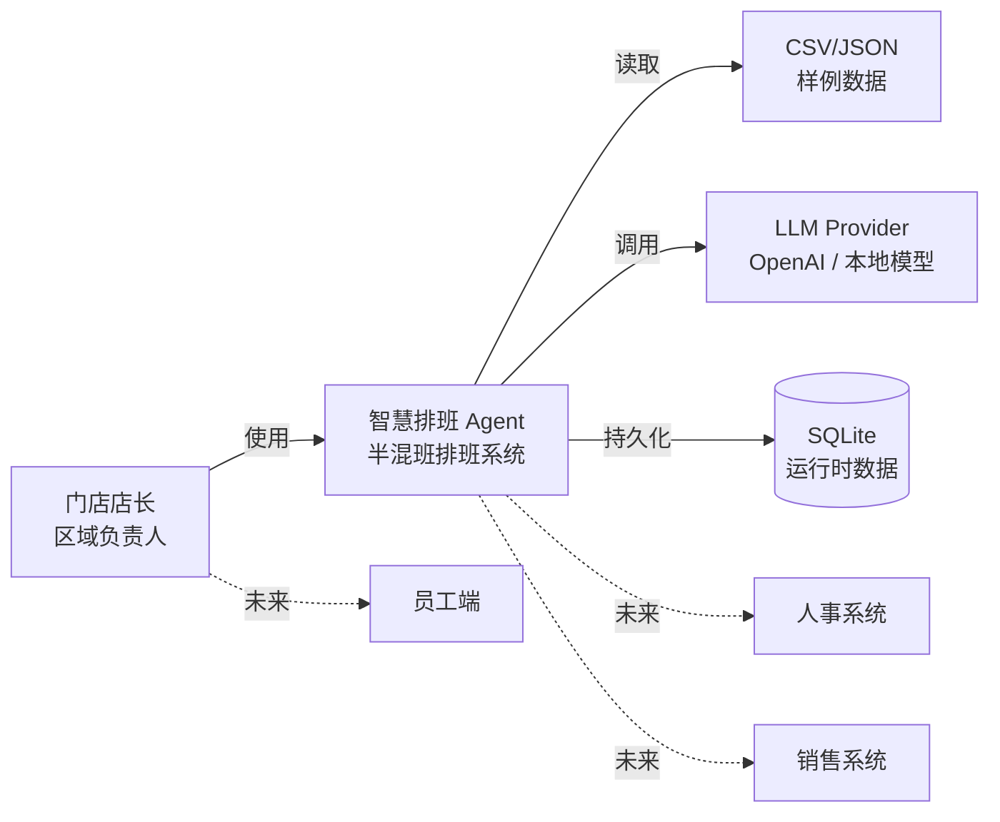

**系统职责：** 接收店长的排班指令，基于历史数据和业务规则生成半混班排班方案，并通过 Agent 提供可追溯的解释。

**外部依赖：**
- LLM Provider：提供自然语言理解与生成能力（可降级）
- 本地样例数据：CSV/JSON 文件（只读）
- SQLite：运行时数据持久化（读写）

---

## 3. 容器架构 (C4 L2)

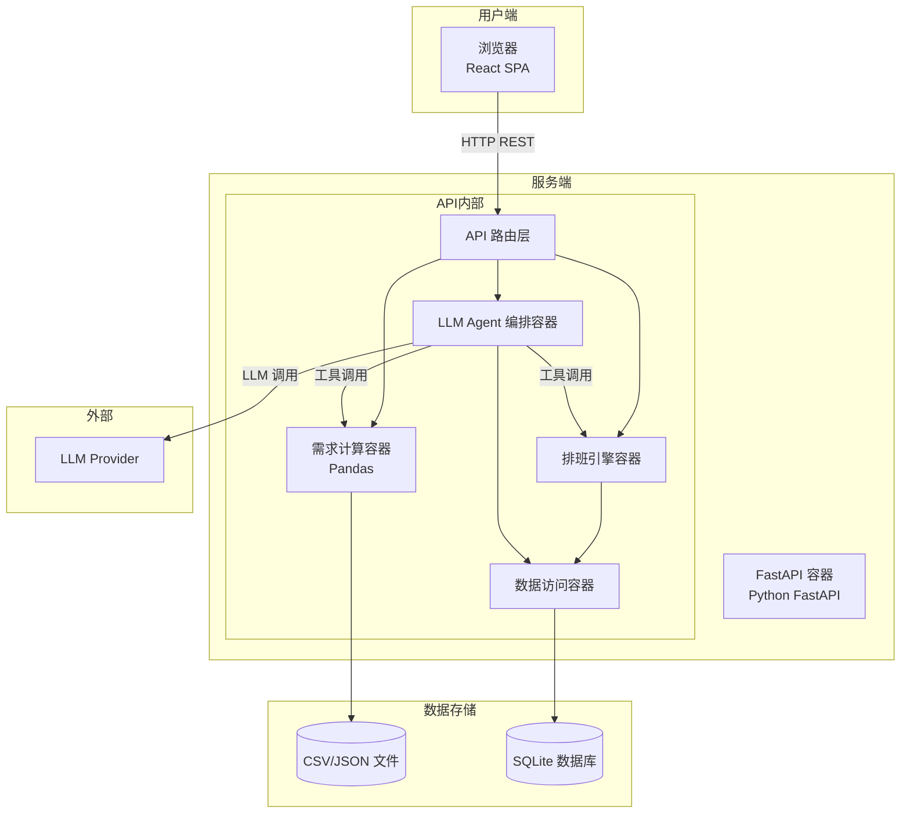

### 3.1 容器职责

| 容器 | 技术 | 职责 |
| --- | --- | --- |
| React SPA | React + TypeScript + Vite | 半混班排班工作台 UI |
| FastAPI 容器 | Python FastAPI + Pydantic | REST API 服务、请求校验、响应序列化 |
| LLM Agent 编排容器 | Python | 意图识别、工具调用编排、解释生成 |
| 需求计算容器 | Python + Pandas | 历史数据聚合、影响因子计算、需求人数生成 |
| 排班引擎容器 | Python | 专业岗锁定、混排池管理、候选人评分、风险检测 |
| 数据访问容器 | Python + SQLite | SQLite CRUD 封装 |
| CSV/JSON 文件 | CSV / JSON | 静态样例数据（只读） |
| SQLite 数据库 | SQLite 3 | 运行时数据持久化（读写） |

---

## 4. 组件架构 (C4 L3)

### 4.1 前端组件架构

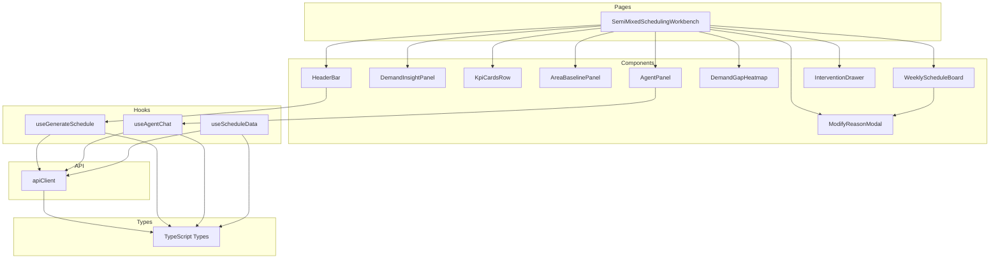

### 4.2 后端组件架构

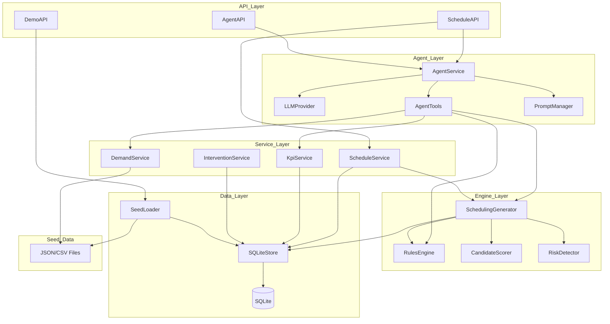

---

## 5. 核心流程设计

### 5.1 排班生成流程

#### 5.1.1 正常流程

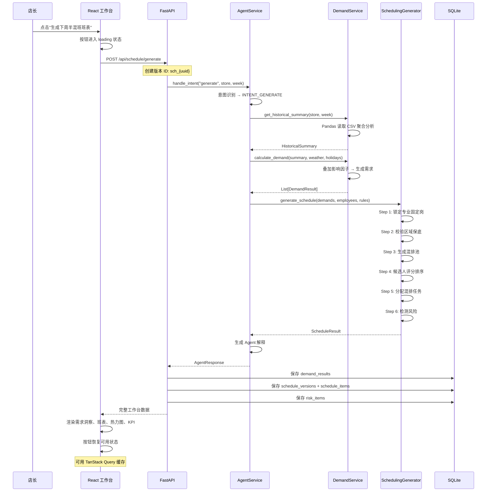

#### 5.1.2 LLM 降级流程

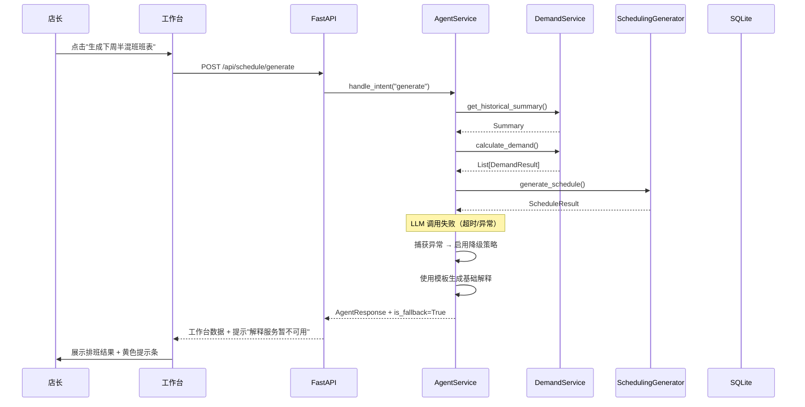

### 5.2 人工干预流程

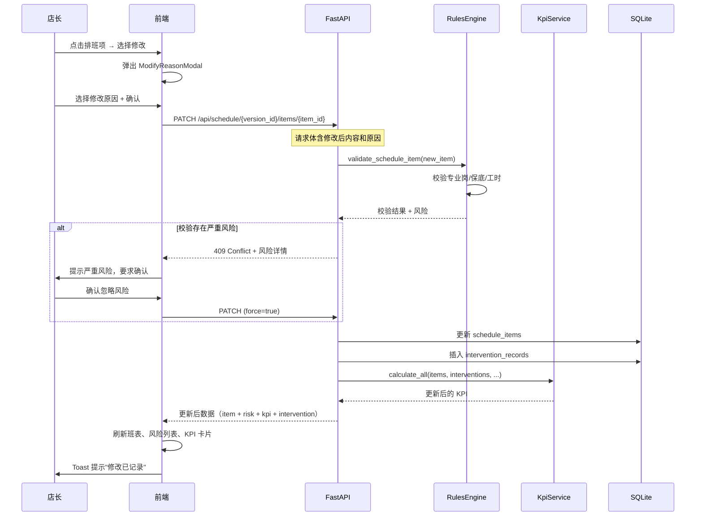

### 5.3 Agent 对话流程

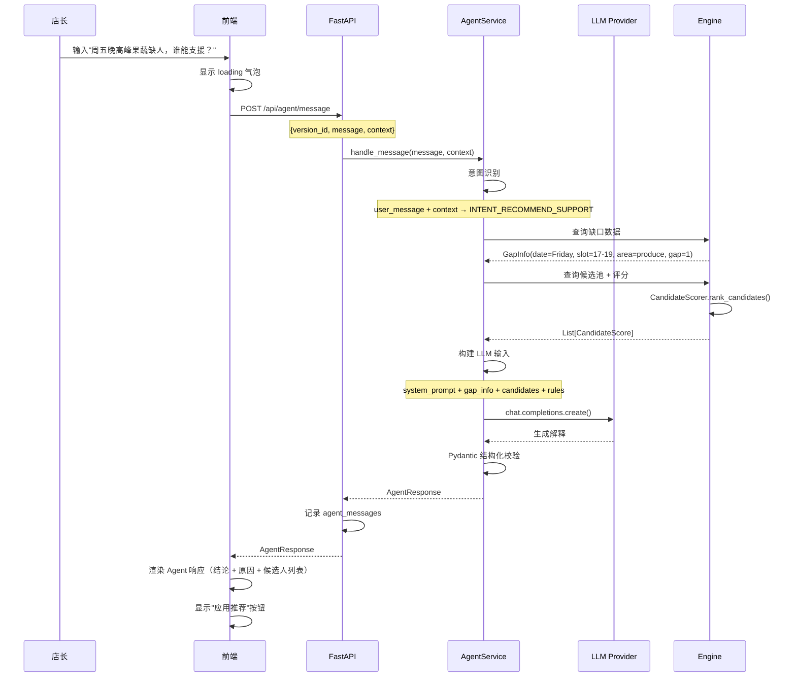

### 5.4 Demo 重置流程

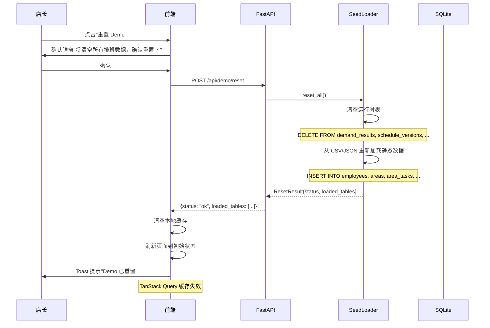

---

## 6. 数据流设计

### 6.1 排班生成数据流

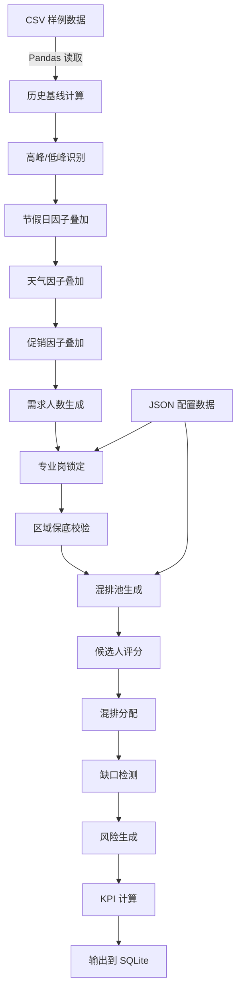

### 6.2 请求数据流

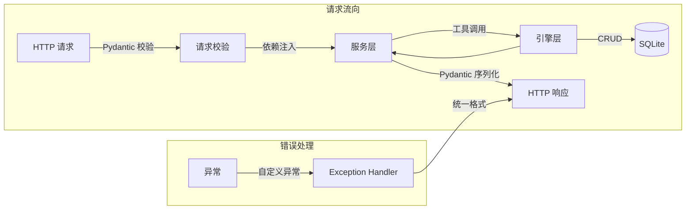

---

## 7. 部署架构

### 7.1 本地开发部署

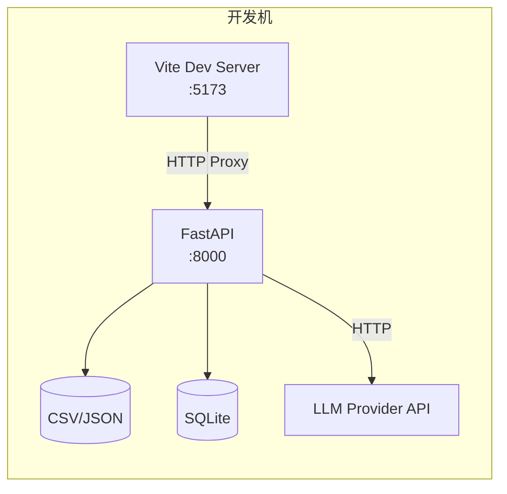

### 7.2 组件通信协议

| 通信双方 | 协议 | 格式 | 说明 |
| --- | --- | --- | --- |
| 浏览器 ↔ FastAPI | HTTP/1.1 | JSON | REST API |
| FastAPI ↔ LLM | HTTPS | JSON (SSE) | OpenAI-compatible API |
| FastAPI ↔ SQLite | SQLite 驱动 | SQL | 本地文件操作 |
| FastAPI ↔ CSV/JSON | 文件 I/O | CSV/JSON | 本地文件读取 |

### 7.3 端口规划

| 服务 | 端口 | 说明 |
| --- | --- | --- |
| Vite Dev Server | 5173 | 前端开发服务器 |
| FastAPI | 8000 | 后端 API 服务 |
| FastAPI Docs | 8000/docs | Swagger 文档 |
| FastAPI Redoc | 8000/redoc | ReDoc 文档 |

---

---

---

## 10. 扩展性设计

### 10.1 扩展点

| 扩展方向 | 当前预留 | 扩展方式 |
| --- | --- | --- |
| 多门店支持 | ScheduleVersion.store_id | 增加门店维度过滤 |
| 真实数据接入 | SeedLoader / DemandService | 替换 CSV 读取为 API 调用 |
| 更多预测因子 | DemandService factor pipeline | 新增 factor 实现类 |
| 约束求解优化 | SchedulingGenerator | 替换为 OR-Tools 等优化求解器 |
| 员工端 | ScheduleItem.employee_id | 增加员工可见的 API 端点 |
| 审批流 | ScheduleVersion.status | 增加审批状态流转 |
| 自动学习 | InterventionRecord | 分析干预原因 → 自动调整规则权重 |

---

## 12. 性能架构

### 12.1 缓存策略

| 缓存对象 | 缓存位置 | 失效策略 | 说明 |
| --- | --- | --- | --- |
| 门店配置 | React Query | 永不刷新 (staleTime: Infinity) | 静态数据，不常变更 |
| 员工数据 | React Query | 永不刷新 | 静态样例数据 |
| 区域配置 | React Query | 永不刷新 | 静态样例数据 |
| 需求结果 | React Query | 5 分钟后失效 | 每次生成排班刷新 |
| 排班版本 | React Query | 5 分钟后失效 | 修改后立即刷新 |
| Agent 响应 | 不缓存 | — | 每次独立请求 |

### 12.2 性能优化措施

| 措施 | 说明 |
| --- | --- |
| 前端代码分割 | 按组件懒加载，减少首屏体积 |
| TanStack Query 缓存 | 减少重复 API 请求 |
| ECharts 懒渲染 | 热力图仅在可见时渲染 |
| FastAPI 异步 | 非阻塞 I/O 提升并发能力 |
| Pandas 向量化 | 批量计算代替逐行循环 |
| SQLite 连接池 | 复用数据库连接 |

---

---

---

