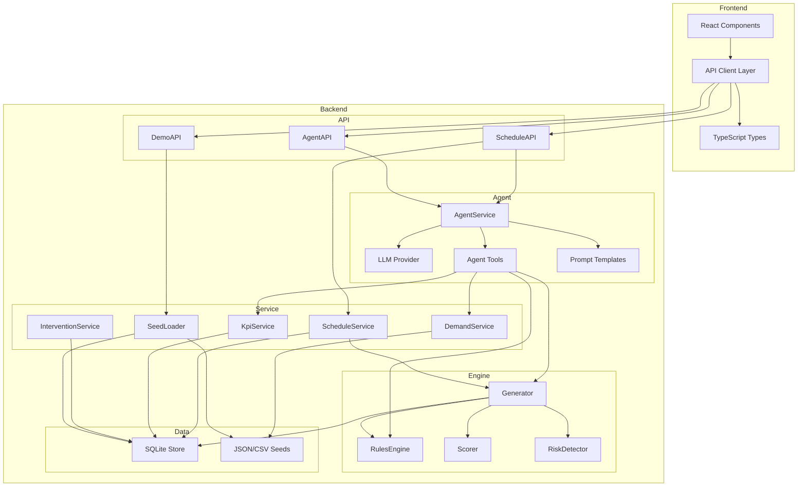

# 智慧排班 Agent — 技术规格说明书 (SPEC)

## 文档信息

| 字段 | 内容 |
| --- | --- |
| 产品名称 | 智慧排班 Agent |
| 文档版本 | v1.0 |
| 文档状态 | 初稿 |
| 创建日期 | 2026-07-12 |
| 对应 PRD | PRD.md |
| 密级 | 内部公开 |

## 修订历史

| 版本 | 日期 | 修订内容 | 修订人 |
| --- | --- | --- | --- |
| v1.0 | 2026-07-12 | 初始版本 | — |

---

## 1. 概述

### 1.1 项目背景

本项目旨在构建一个面向生鲜商超的半混班智能排班系统。系统通过 LLM Agent 编排，结合历史经营数据（销售、客流、订单）、影响因子（节假日、天气、促销）和半混班业务规则，自动生成可解释的排班方案。

### 1.2 系统目标

| 目标 | 描述 |
| --- | --- |
| T-01 | 支持单门店、单周的半混班排班自动生成 |
| T-02 | 专业岗位（杀鱼、切肉等）由 S/A 级专业人员稳定覆盖 |
| T-03 | 高峰缺口可通过全店混排池自动补位 |
| T-04 | 每个排班决策可追溯到数据、规则和评分依据 |
| T-05 | 支持店长人工干预，记录修改原因并统计干预率 |
| T-06 | 支持零录入演示，5 分钟展示完整闭环 |

### 1.3 适用范围

本规格说明书面向研发团队，涵盖技术选型、模块设计、核心算法、数据设计、测试策略和运维部署等全部技术维度。

---

## 2. 技术栈

### 2.1 技术选型总览

| 分层 | 技术选型 | 版本 | 用途 | 选型理由 |
| --- | --- | --- | --- | --- |
| 前端框架 | React + TypeScript | React 18+, TS 5+ | 半混班排班工作台 | 组件化生态成熟，类型安全，适合高信息密度后台 |
| 构建工具 | Vite | 5+ | 本地开发与构建 | 冷启动快，HMR 即时响应，优于 CRA/Webpack |
| UI 体系 | Tailwind CSS + shadcn/ui | Tailwind 3+, shadcn/ui latest | 页面布局、卡片、弹窗、标签、表格 | 原子化 CSS 按需生成，shadcn/ui 提供无障碍、可定制的组件基座 |
| 图表可视化 | Apache ECharts | 5+ | 需求热力图、缺口热力图、干预原因分布 | 成熟度高，热力图/雷达图等复杂图表原生支持 |
| 状态管理 | TanStack Query (React Query) | 5+ | 服务端状态管理（请求、缓存、加载态） | 自动缓存、后台刷新、乐观更新，专为 API 状态设计 |
| 后端框架 | FastAPI + Pydantic | FastAPI 0.110+, Pydantic 2+ | REST API、数据校验、结构化输出 | 异步原生、自动生成 OpenAPI、Pydantic v2 性能提升 |
| 数据处理 | Pandas | 2+ | 历史数据聚合、峰谷识别、因子计算 | 数据分析生态标准，DataFrame 操作高效 |
| 本地存储 | SQLite | 3+ | 排班版本、需求结果、Agent 记录、干预记录 | 零配置、单文件、适合 Demo 阶段 |
| LLM Agent | LangChain / 自定义 Provider + 工具调用 | — | 意图理解、需求推理、策略生成、解释输出 | Provider 可切换，工具调用模式可观测、可兜底 |
| 测试框架 | Pytest + Vitest | Pytest 8+, Vitest 1+ | 后端规则/计算测试、前端组件测试 | 社区标准，成熟度高 |
| 代码规范 | ESLint + Prettier + Ruff | — | 前后端代码风格统一 | 行业标准工具链 |

---


## 3. 系统架构

### 3.1 架构分层

```
┌─────────────────────────────────────────────────────────────────────┐
│                        展示层 (Presentation)                        │
│  React + TypeScript Vite SPA                                       │
│  ┌──────────┐ ┌──────────┐ ┌──────────┐ ┌──────────┐ ┌──────────┐ │
│  │HeaderBar │ │KpiCards  │ │AreaPanel │ │WeekBoard│ │AgentChat │ │
│  └──────────┘ └──────────┘ └──────────┘ └──────────┘ └──────────┘ │
├─────────────────────────────────────────────────────────────────────┤
│                        API 网关层 (Gateway)                         │
│  FastAPI + Pydantic v2                                             │
│  ┌─────────────┐ ┌─────────────┐ ┌─────────────┐                  │
│  │schedule_api │ │  agent_api  │ │  demo_api   │                  │
│  └─────────────┘ └─────────────┘ └─────────────┘                  │
├─────────────────────────────────────────────────────────────────────┤
│                      编排层 (Orchestration)                         │
│  ┌──────────────────────────────────────────────────────────────┐  │
│  │                    LLM Agent Service                          │  │
│  │  意图识别 → 工具调用 → 结果聚合 → 解释生成                    │  │
│  │  工具: get_historical_summary / calculate_demand /            │  │
│  │        generate_schedule / validate_schedule /                │  │
│  │        recommend_support / record_intervention                │  │
│  └──────────────────────────────────────────────────────────────┘  │
├─────────────────────────────────────────────────────────────────────┤
│                       业务服务层 (Service)                          │
│  ┌───────────────┐ ┌───────────────┐ ┌───────────────┐            │
│  │ DemandService │ │ScheduleService│ │ KpiService    │            │
│  │ (Pandas计算)   │ │ (版本管理)    │ │ (指标计算)    │            │
│  └───────────────┘ └───────────────┘ └───────────────┘            │
│  ┌───────────────┐ ┌───────────────┐                              │
│  │Intervention   │ │ SeedLoader   │                              │
│  │Service        │ │ (数据加载)    │                              │
│  └───────────────┘ └───────────────┘                              │
├─────────────────────────────────────────────────────────────────────┤
│                        排班引擎层 (Engine)                          │
│  ┌───────────────┐ ┌───────────────┐ ┌───────────────┐            │
│  │  Generator    │ │  Rules Engine │ │  Scorer      │            │
│  │  (排班主流程)  │ │  (规则校验)   │ │  (候选人评分) │            │
│  └───────────────┘ └───────────────┘ └───────────────┘            │
│  ┌───────────────┐                                                │
│  │  RiskDetector │                                                │
│  │  (风险检测)   │                                                │
│  └───────────────┘                                                │
├─────────────────────────────────────────────────────────────────────┤
│                        数据层 (Data)                                │
│  ┌───────────────────┐ ┌───────────────────┐                      │
│  │ CSV/JSON 样例数据  │ │  SQLite (运行时)   │                      │
│  │ (只读原始数据)     │ │  (读写运行结果)    │                      │
│  └───────────────────┘ └───────────────────┘                      │
└─────────────────────────────────────────────────────────────────────┘
```

### 3.2 模块依赖关系



---

## 4. 前端设计

### 4.1 页面结构

```text
SemiMixedSchedulingWorkbench (页面根组件)
  ├── HeaderBar
  │   ├── StoreInfo                    # 门店名称、ID
  │   ├── WeekSelector                 # 周选择器（前后切换）
  │   ├── GenerateButton               # "生成下周半混班班表" 按钮
  │   ├── ResetButton                  # "重置 Demo" 按钮
  │   └── LastGeneratedInfo            # 上次生成时间、版本号
  ├── DemandInsightPanel               # 需求洞察（可折叠面板）
  │   ├── PeakHoursIndicator           # 本周高峰/低峰时段分布
  │   ├── HolidayIndicator             # 本周节假日标记
  │   ├── WeatherIndicator             # 本周天气预报影响
  │   └── PromotionIndicator           # 本周促销活动标记
  ├── KpiCardsRow                      # KPI 卡片行
  │   ├── ProfessionalCoverageCard     # 专业岗覆盖率
  │   ├── BaselineAchievementCard      # 区域保底达成率
  │   ├── MixedUtilizationCard         # 混排利用率
  │   ├── InterventionRateCard         # 人工干预率
  │   └── PeakGapCountCard             # 高峰缺口数
  ├── MainContentLayout                # 主内容区（左右布局）
  │   ├── AreaBaselinePanel (左侧)     # 区域面板
  │   │   ├── AquaticAreaCard          # 水产区
  │   │   ├── MeatAreaCard             # 肉类区
  │   │   ├── ProduceAreaCard          # 果蔬区
  │   │   ├── CashierAreaCard          # 收银/前场
  │   │   └── ReplenishmentAreaCard    # 补货区
  │   ├── WeeklyScheduleBoard (中间)   # 周班表
  │   │   ├── DayColumn (×7)           # 每日列
  │   │   │   ├── SlotRow              # 时段行
  │   │   │   │   ├── AreaCell         # 区域格
  │   │   │   │   │   ├── EmployeeTag  # 员工标签
  │   │   │   │   │   └── RiskBadge    # 风险徽标
  │   │   └── LegendBar                # 图例
  │   └── AgentPanel (右侧)            # Agent 对话面板
  │       ├── QuickQuestions            # 快捷问题列表
  │       ├── ChatMessages              # 对话消息列表
  │       ├── MessageInput              # 消息输入框
  │       └── CandidateList             # 候选人推荐列表
  ├── DemandGapHeatmap (下方)          # 缺口热力图
  │   ├── YAxis: AreaCode              # Y 轴：区域
  │   ├── XAxis: Slot                  # X 轴：时段
  │   └── Cell: GapCount               # 单元格：缺口数（颜色编码）
  └── InterventionDrawer (底部抽屉)    # 干预记录抽屉
      ├── InterventionList             # 干预记录列表
      ├── ReasonDistributionChart      # 原因分布图
      └── InterventionRateTrend        # 干预率趋势
```

### 4.2 组件职责矩阵

| 组件 | 输入 Props | 输出 Events | 状态管理 | 加载态 | 空态 | 错误态 |
| --- | --- | --- | --- | --- | --- | --- |
| HeaderBar | storeInfo, weekStart, isGenerating | onGenerate, onReset, onWeekChange | 无 | 生成按钮 loading | — | 生成失败 toast |
| DemandInsightPanel | demandInsights | — | 无 | Skeleton 占位 | "暂无需求数据" | "需求数据加载失败" |
| KpiCardsRow | kpis | — | 无 | Skeleton 卡片 | "暂无 KPI" | — |
| AreaBaselinePanel | areas, scheduleItems | onAreaClick | 无 | 骨架屏 | "暂无区域配置" | "区域数据异常" |
| WeeklyScheduleBoard | scheduleItems, versionId | onItemClick, onItemModify | 无 | 骨架屏 + 灰色占位 | "请先生成排班" | "排班数据异常" |
| AgentPanel | versionId, context | onCandidateApply | 对话消息列表 | 打字机效果 | 快捷问题展示 | "Agent 暂不可用，使用规则结果" |
| DemandGapHeatmap | demandResults, scheduleItems | — | 无 | 热力图骨架 | "暂无需求数据" | — |
| InterventionDrawer | interventionRecords | — | 展开/收起 | 列表骨架 | "暂无干预记录" | "记录加载失败" |

### 4.3 核心类型定义

```typescript
// === 需求相关 ===
interface DemandSlot {
  date: string;                    // 2026-07-13
  weekday: string;                 // Monday
  slot: string;                    // 17:00-19:00
  areaCode: string;                // produce
  taskCode: string;                // restock
  requiredCount: number;           // 3
  demandScore: number;             // 86 (0-100)
  demandFactors: string[];         // ["晚高峰", "周五", "降雨"]
  priority: 'high' | 'normal' | 'low';
  confidence: 'high' | 'medium' | 'low';
  isProtected: boolean;
}

// === 员工相关 ===
type EmployeeType = 'professional' | 'regional' | 'mixed' | 'floating';
type SkillLevel = 'S' | 'A' | 'B' | 'C';

interface EmployeeSkill {
  taskCode: string;
  skillLevel: SkillLevel;
  areaFamiliarity: number;         // 0-1
}

interface Employee {
  id: string;                      // emp_001
  name: string;                    // 老王
  mainArea: string;                // aquatic
  employeeType: EmployeeType;
  skills: EmployeeSkill[];
  weeklyHoursLimit: number;        // 40
  canMixed: boolean;
  currentWeeklyHours?: number;     // 动态计算
}

// === 排班相关 ===
type AssignmentType = 'fixed' | 'regional' | 'mixed';
type RiskLevel = 'none' | 'info' | 'warning' | 'critical';
type ScheduleSource = 'system' | 'manual';

interface ScheduleItem {
  id: string;                      // si_001
  date: string;
  slot: string;
  areaCode: string;
  taskCode: string;
  employeeId: string;
  employeeName: string;
  assignmentType: AssignmentType;
  isProtected: boolean;
  riskLevel: RiskLevel;
  explanation?: string;
  source: ScheduleSource;
}

interface ScheduleVersion {
  id: string;                      // sch_001
  storeId: string;
  weekStart: string;
  status: 'generated' | 'confirmed';
  createdAt: string;
  updatedAt?: string;
  agentSummary?: string;
}

// === Agent 相关 ===
interface Candidate {
  employeeId: string;
  employeeName: string;
  skills: string[];
  score: number;                   // 0-100
  reason: string;
  risks: CandidateRisk[];
}

interface CandidateRisk {
  type: 'warning' | 'critical';
  description: string;
}

interface AgentResponse {
  intent: string;
  conclusion: string;
  reasons: string[];
  candidates?: Candidate[];
  nextActions: string[];
}

// === 风险相关 ===
type RiskType = 'professional_gap' | 'baseline_shortage' | 'skill_mismatch' | 'overtime' | 'mixed_overuse';

interface RiskItem {
  id: string;
  type: RiskType;
  level: 'critical' | 'warning' | 'info';
  description: string;
  affectedItemIds: string[];
  suggestion?: string;
}

// === KPI 相关 ===
interface KpiResult {
  professionalCoverageRate: number;     // 0-1
  baselineAchievementRate: number;      // 0-1
  mixedUtilizationRate: number;         // 0-1
  peakGapCount: number;
  interventionRate: number;             // 0-1
}

// === 干预相关 ===
interface InterventionRecord {
  id: string;
  scheduleItemId: string;
  before: Partial<ScheduleItem>;
  after: Partial<ScheduleItem>;
  reasonCode: string;
  reasonText?: string;
  createdAt: string;
}

// === 配置相关 ===
interface AreaConfig {
  code: string;
  name: string;
  allowMixed: boolean;
  baselineMin: number;
  baselineMax: number;
}

interface AreaTask {
  id: string;
  areaCode: string;
  taskCode: string;
  taskName: string;
  isProfessional: boolean;
  minSkillLevel: SkillLevel;
  priority: number;
}
```

### 4.4 状态管理策略

| 数据类型 | 管理方式 | 缓存策略 | 更新触发 |
| --- | --- | --- | --- |
| 门店信息 | 全局 Context | 持久 | 应用加载 |
| 区域配置 | TanStack Query | staleTime: Infinity | 应用加载 |
| 员工数据 | TanStack Query | staleTime: Infinity | 应用加载 |
| 需求结果 | TanStack Query | staleTime: 5min | 生成排班 |
| 排班版本 | TanStack Query | staleTime: 5min | 生成/修改 |
| KPI | TanStack Query | staleTime: 1min | 生成/修改 |
| 风险列表 | TanStack Query | staleTime: 1min | 生成/修改 |
| Agent 对话 | 本地 state (useReducer) | 不缓存 | 用户输入 |
| 干预记录 | TanStack Query | staleTime: 30s | 修改操作 |

### 4.5 前端路由设计

| 路径 | 页面 | 说明 |
| --- | --- | --- |
| / | SemiMixedSchedulingWorkbench | 主工作台（单页应用） |
| /demo/reset | — | 重置 API 触发，无独立页面 |

Demo 为单页应用，不涉及多页面路由。

---

## 5. 后端设计

### 5.1 目录结构

```text
backend/
├── app/
│   ├── __init__.py
│   ├── main.py                          # FastAPI 应用入口，路由注册，CORS 配置
│   │
│   ├── api/                             # HTTP 接口层
│   │   ├── __init__.py
│   │   ├── schedule_api.py              # POST/GET/PATCH /api/schedule/*
│   │   ├── agent_api.py                 # POST /api/agent/*
│   │   └── demo_api.py                  # POST/GET /api/demo/*
│   │
│   ├── schemas/                         # Pydantic 模型定义
│   │   ├── __init__.py
│   │   ├── demand.py                    # DemandResult, DemandSlot
│   │   ├── schedule.py                  # ScheduleItem, ScheduleVersion, KpiResult
│   │   ├── agent.py                     # AgentRequest, AgentResponse, Candidate
│   │   ├── risk.py                      # RiskItem, RiskType
│   │   ├── employee.py                  # Employee, EmployeeSkill, SkillLevel
│   │   ├── area.py                      # AreaConfig, AreaTask
│   │   └── intervention.py              # InterventionRecord, InterventionRequest
│   │
│   ├── services/                        # 业务服务层
│   │   ├── __init__.py
│   │   ├── demand_service.py            # 需求计算：Pandas 聚合 + 因子叠加
│   │   ├── schedule_service.py          # 排班版本管理：CRUD + 版本控制
│   │   ├── kpi_service.py               # KPI 计算：覆盖率/达成率/利用率/干预率
│   │   └── intervention_service.py      # 干预记录：保存 + 统计
│   │
│   ├── agent/                           # LLM Agent 层
│   │   ├── __init__.py
│   │   ├── agent_service.py             # Agent 编排：意图识别 → 工具调用 → 响应组装
│   │   ├── provider.py                  # LLM Provider 适配器（OpenAI / 本地模型）
│   │   ├── prompts.py                   # 提示词模板（system prompt + tool descriptions）
│   │   ├── tools.py                     # Agent 工具定义 + 调用映射
│   │   └── structured_outputs.py        # Pydantic 结构化输出模型
│   │
│   ├── scheduling/                      # 排班引擎层
│   │   ├── __init__.py
│   │   ├── generator.py                 # 排班主流程调度器
│   │   ├── rules.py                     # 规则引擎：专业岗/保护时段/保底/工时校验
│   │   ├── scorer.py                    # 候选人评分：加权评分 + 归一化
│   │   ├── risks.py                     # 风险检测：缺口/超工时/技能不匹配
│   │   └── constants.py                 # 排班常量：权重配置、默认值
│   │
│   ├── data/                            # 数据层
│   │   ├── __init__.py
│   │   ├── seed_loader.py               # 样例数据加载器：CSV/JSON → SQLite
│   │   ├── sqlite_store.py              # SQLite CRUD 操作封装
│   │   ├── database.py                  # 数据库连接管理 + DDL 初始化
│   │   └── demo.sqlite                  # SQLite 数据库文件
│   │
│   ├── seed/                            # 样例数据文件（只读）
│   │   ├── employees.json               # 员工数据
│   │   ├── areas.json                   # 区域配置
│   │   ├── area_tasks.json              # 区域任务配置
│   │   ├── skill_definitions.json       # 技能等级定义
│   │   ├── employee_skills.json         # 员工技能映射
│   │   ├── modified_reasons.json        # 修改原因字典
│   │   ├── historical_sales.csv         # 历史销售数据
│   │   ├── historical_traffic.csv       # 历史客流数据
│   │   ├── online_orders.csv            # 线上订单数据
│   │   ├── weather.csv                  # 天气数据
│   │   └── holidays.csv                 # 节假日数据
│   │
│   └── core/                            # 核心基础设施
│       ├── __init__.py
│       ├── config.py                    # 配置管理（环境变量 + 默认值）
│       ├── exceptions.py               # 自定义异常类
│       └── dependencies.py             # FastAPI 依赖注入
│
├── tests/                               # 测试目录
│   ├── __init__.py
│   ├── conftest.py                      # Pytest fixtures
│   ├── test_demand_service.py
│   ├── test_schedule_service.py
│   ├── test_rules.py
│   ├── test_scorer.py
│   ├── test_risks.py
│   ├── test_kpi_service.py
│   └── test_agent_structured_output.py
│
├── requirements.txt                     # Python 依赖
├── pyproject.toml                       # 项目配置
└── README.md
```

### 5.2 核心服务职责

| 模块 | 类/文件 | 核心职责 |
| --- | --- | --- |
| 需求计算 | DemandService | 读取历史销售/客流/订单数据，叠加节假日、天气、促销因子，输出分区域分时段需求 |
| 排班生成 | SchedulingGenerator | 执行半混班全流程：锁定专业岗 → 校验保底 → 构建混排池 → 评分分配 |
| 规则引擎 | RulesEngine | 校验专业资质、保护时段、区域保底、工时上限、技能匹配等约束 |
| 候选人评分 | CandidateScorer | 按技能(35%)、熟悉度(20%)、剩余工时(15%)、高峰适配(10%)、区域影响(15%)、偏好(5%)加权评分 |
| KPI 计算 | KpiService | 计算专业岗覆盖率、区域保底达成率、混排利用率、人工干预率 |
| 风险检测 | RiskDetector | 检测缺口、超工时、技能不匹配、混排过度使用等风险 |

---

## 6. LLM Agent 设计

### 6.1 Agent 编排流程

```text
用户输入 "生成下周半混班班表"
  → AgentService.handle_message()
    → 1. 意图识别 (intent_classification)
      → INTENT_GENERATE
    → 2. 工具调用序列
      → 2.1 get_historical_summary(store_id, week)
        → 读取历史数据摘要
        → 返回 {peak_hours, avg_traffic, holiday_effects}
      → 2.2 calculate_demand(historical_summary, weather, holidays)
        → DemandService.generate_weekly_demand()
        → 返回 List[DemandResult]
      → 2.3 generate_schedule(demands, employees, rules)
        → SchedulingGenerator.generate()
        → 返回 ScheduleResult
      → 2.4 validate_schedule(schedule_result)
        → RulesEngine + RiskDetector
        → 返回 List[RiskItem]
      → 2.5 如果存在缺口，调用 recommend_support(gap, candidates)
        → CandidateScorer.rank_candidates()
        → 返回 List[CandidateScore]
    → 3. 结果聚合
      → 汇总需求洞察、排班结果、风险、推荐
    → 4. LLM 生成解释
      → 调用 LLM 生成自然语言总结和解释
    → 5. 结构化响应
      → 返回 AgentResponse
```

### 6.2 工具定义

| 工具名称 | 描述 | 输入参数 | 输出结果 | 是否必须 |
| --- | --- | --- | --- | --- |
| get_historical_summary | 获取历史数据摘要，用于判断需求趋势 | store_id, week_start | HistoricalSummary | 是 |
| calculate_demand | 基于历史摘要和影响因子计算用工需求 | summary, weather, holidays, promotions | List[DemandResult] | 是 |
| generate_schedule | 基于需求数据和半混班规则生成排班 | demands, employees, areas, tasks | ScheduleResult | 是 |
| validate_schedule | 校验排班结果，返回风险和不可调原因 | schedule_result, rules | List[RiskItem] | 是 |
| recommend_support | 针对缺口推荐支援候选人 | gap_info, candidates_pool | List[CandidateScore] | 条件（有缺口时） |
| record_intervention | 记录人工修改操作 | before, after, reason | InterventionRecord | 条件（有修改时） |
| explain_demand | 解释特定时段需求计算依据 | demand_id, factors | DemandExplanation | 否 |
| explain_fixed | 解释特定员工固定岗原因 | employee_id, area, slot | FixedExplanation | 否 |
| explain_blocked | 解释不可调原因 | employee_id, target_area, target_slot | BlockedExplanation | 否 |

### 6.3 提示词设计

#### 6.3.1 System Prompt

```text
你是一个智慧排班 Agent，负责生鲜商超门店的半混班排班。你的核心职责是：

1. 理解店长关于排班的自然语言指令。
2. 使用工具获取历史数据摘要、计算需求、生成排班、校验规则。
3. 对排班结果和风险给出清晰、可追溯的解释。
4. 对不可调整的排班给出充分的拒绝理由和替代方案。

半混班核心原则：
- 专业固定岗（杀鱼、切肉等）必须由 S/A 级专业人员覆盖。
- 保护时段内专业人士不得跨区抽调。
- 核心区域关键时段必须满足保底人数。
- 高峰期缺口优先从混排池补位。

你的回答必须包含三部分：
1. 结论：做了什么/能不能做/推荐谁。
2. 原因：基于数据、规则和评分的具体解释。
3. 下一步：建议用户可执行的操作。

请注意：
- 你只负责编排和解释，数值计算和规则校验由 Python 工具完成。
- 如果 LLM 服务不可用，系统会使用规则兜底结果。
- 对于超出 Demo 范围的问题，请礼貌说明暂不支持。
```

#### 6.3.2 Intent Classification Prompt

```text
根据用户输入判断意图，从以下列表中选择最匹配的一项：

INTENT_GENERATE: 用户要求生成排班（关键词：生成、排班、班表、下周）
INTENT_EXPLAIN_DEMAND: 用户询问需求原因（关键词：为什么需要、为什么缺、需求依据）
INTENT_EXPLAIN_FIXED: 用户询问固定岗原因（关键词：为什么一直在、为什么固定在）
INTENT_RECOMMEND_SUPPORT: 用户询问支援人选（关键词：谁能支援、缺人、推荐）
INTENT_EXPLAIN_BLOCKED: 用户询问为什么不能调动（关键词：能不能调、为什么不）
INTENT_LIST_RISKS: 用户询问风险（关键词：风险、问题、需要注意）
INTENT_REDUCE_INTERVENTION: 用户询问如何减少干预（关键词：减少修改、优化规则）
UNKNOWN: 无法识别

用户输入：{user_message}
意图：
```

### 6.4 结构化输出 Schema

```python
class AgentResponse(BaseModel):
    """Agent 响应结构化输出"""

    intent: str = Field(description="识别到的意图编码")
    summary: str = Field(description="Agent 操作总结，一句话说明做了什么")
    demand_reasoning: List[str] = Field(
        default=[],
        description="需求推理过程，每条一句话"
    )
    schedule_highlights: List[str] = Field(
        default=[],
        description="排班亮点，每条一句话"
    )
    candidates: Optional[List[CandidateInfo]] = Field(
        default=None,
        description="推荐的候选人列表"
    )
    risks: List[RiskInfo] = Field(
        default=[],
        description="风险列表"
    )
    next_actions: List[str] = Field(
        default=[],
        description="建议用户的后续操作"
    )

    @field_validator('intent')
    @classmethod
    def validate_intent(cls, v):
        allowed = [
            'generate_schedule', 'explain_demand', 'explain_fixed',
            'recommend_support', 'explain_blocked', 'list_risks',
            'reduce_intervention', 'unknown'
        ]
        if v not in allowed:
            raise ValueError(f'intent 必须是 {allowed} 之一，收到: {v}')
        return v


class CandidateInfo(BaseModel):
    """候选人信息"""
    employee_name: str
    skills: List[str]
    score: int = Field(ge=0, le=100)
    recommended: bool
    reason: str
    risks: List[str] = []


class RiskInfo(BaseModel):
    """风险信息"""
    level: Literal['critical', 'warning', 'info']
    description: str
    suggestion: Optional[str] = None
```

### 6.5 异常与兜底策略

| 异常场景 | 检测方式 | 兜底策略 |
| --- | --- | --- |
| LLM 调用超时 | Provider 超时异常 (30s) | 返回程序计算的需求和排班结果，备注"解释服务暂不可用" |
| LLM 返回格式非法 | Pydantic 校验失败 | 重试 1 次，仍失败则使用规则兜底结果 |
| LLM 返回空内容 | 空字符串检测 | 使用模板填充默认解释 |
| 意图识别置信度低 | 得分阈值 < 0.6 | 默认走 INTENT_GENERATE 或返回 UNKNOWN 引导用户 |
| 工具调用失败 | 工具函数异常 | 记录错误日志，跳过该工具，继续执行剩余流程 |

---

## 7. 需求计算方案

### 7.1 影响因子体系

| 因子类型 | 数据来源 | 影响方向 | 影响幅度 | 置信度影响 |
| --- | --- | --- | --- | --- |
| 高峰/低峰 | 历史客流、交易数百分位 | 高峰上浮，低峰下浮 | ±30%~50% | high |
| 节假日 | 节假日配置表 | 需求上浮 | +20% | high（已知节假日）/ medium（调休） |
| 周末 | 日期计算 | 需求上浮 | +10% | high |
| 天气-降雨 | 天气数据 rain_level | 到店-10%~-20%，线上+15%~+25% | ±10%~25% | medium（天气预报不确定性） |
| 天气-高温 | 天气数据 temperature | 到店-5%~-15%，线上+10%~+20% | ±5%~20% | medium |
| 促销 | 促销配置表 promotion_type | 区域需求上浮 | +20%~+40% | high（已知促销）/ low（临时促销） |
| 历史基线 | 同星期同时间段均值 | 基础参考值 | — | high（数据充足）/ low（数据稀疏） |

### 7.2 需求计算公式

```
demand_count = baseline_count × holiday_factor × weather_factor × promotion_factor

demand_score = min(100, baseline_score × 100 × factor_product)

confidence:
  - high: 数据充足(>4周同星期数据) 且 因子均为已知
  - medium: 数据一般(2-4周) 或 含天气预报等不确定性因子
  - low: 数据不足(<2周) 或 含多个不确定性因子
```

### 7.3 高峰/低峰识别算法

```python
def identify_peak_slots(traffic_df: pd.DataFrame, sales_df: pd.DataFrame) -> List[PeakSlot]:
    """
    基于历史数据识别高峰/低峰时段

    算法：
    1. 按 slot 聚合客流和交易数的均值
    2. 计算每个 slot 的百分位排名
    3. top 25% → high, 25%-75% → normal, bottom 25% → low
    4. 叠加区域特定高峰（如水产早市 08:00-11:00）
    """
    # slot 粒度建议：早 08-11, 中 11-14, 午 14-17, 晚 17-20
    ...
```

---

## 8. 排班算法

### 8.1 排班主流程详细设计

```python
def generate_schedule(
    demands: List[DemandResult],
    employees: List[Employee],
    areas: List[AreaConfig],
    area_tasks: List[AreaTask],
    version_id: str
) -> ScheduleResult:
    """
    半混班排班主流程

    Step 1: 初始化
    Step 2: 按时间逐 slot 逐区域处理
    Step 3: 对每个 slot 执行:
      a. 识别专业固定岗需求
      b. 从专业员工池匹配（S/A 级 + 主区域 + 保护时段）
      c. 校验区域保底
      d. 剩余需求加入待分配池
    Step 4: 对待分配任务排序（高峰 > 普通 > 低峰）
    Step 5: 生成混排候选人池
    Step 6: 对每个待分配任务:
      a. 筛选合格候选人
      b. 评分排序
      c. 分配最优候选人
    Step 7: 检测未满足需求 → 生成缺口
    Step 8: 检测所有风险
    Step 9: 计算 KPI
    """
```

### 8.2 候选人评分详细公式

```python
def calculate_total_score(
    skill_match: SkillLevel,       # S/A/B/C
    area_familiarity: float,       # 0-1
    current_weekly_hours: float,   # 当前已排小时
    max_hours: int,                # 周工时上限
    is_peak_adapted: bool,         # 是否有高峰经验
    area_impact: bool,             # 是否影响主区域保底
    preference_match: bool,        # 是否匹配员工偏好
    slot_hours: float              # 当前时段小时数
) -> float:
    """
    候选人得分 = 各项加权和 - 风险扣分

    技能匹配分 (0-35):
      S→35, A→31.5, B→24.5, C→0

    区域熟悉度分 (0-20):
      主区域→20, 曾支援→16, 未支援但可做→10, 不熟悉→0

    剩余工时分 (0-15):
      remaining = max_hours - current_weekly_hours
      score = 15 * (remaining / max_hours)  # 归一化
      capped at 15

    高峰适配分 (0-10):
      is_peak_adapted → 10, else → 0

    主区域不受影响分 (0-15):
      area_impact == True → 15, else → 0

    偏好匹配分 (0-5):
      preference_match → 5, else → 0

    风险扣分:
      超工时风险 → 扣 30（直接淘汰）
      技能不足风险 → 扣 20
      跨区频率过高 → 扣 5
    """
```

### 8.3 约束满足策略

| 约束类型 | 处理方式 | 违反后果 |
| --- | --- | --- |
| 专业岗资质 (硬) | 前置过滤，不满足直接排除 | 严重风险 |
| 保护时段 (硬) | 前置过滤，保护时段内不推荐跨区 | 严重风险 |
| 区域保底 (硬) | 分配时校验，抽走人员会破坏保底则拒绝 | 警告风险 |
| 周工时上限 (硬) | 超过上限不进入候选人列表 | 标记超工时 |
| 技能匹配 (软) | 评分加权，低分不排除但提示风险 | 黄色提醒 |
| 员工偏好 (软) | 评分加分项 | 不满足不扣分 |

---

## 9. 数据设计

### 9.1 数据分类

| 分类 | 说明 | 示例 |
| --- | --- | --- |
| 静态配置数据 | 门店、区域、任务、员工、技能等级定义 | areas.json, employees.json |
| 历史经营数据 | 销售、客流、订单、天气、节假日 | historical_sales.csv |
| 运行时数据 | 需求结果、排班版本、排班项、风险 | SQLite 表 |
| 操作日志数据 | 干预记录、Agent 对话记录 | SQLite 表 |

---

## 10. 测试策略

### 10.1 测试层级

| 层级 | 框架 | 覆盖范围 | 运行频率 | 目标覆盖率 |
| --- | --- | --- | --- | --- |
| 单元测试 | Pytest | 核心算法：需求计算、候选人评分、规则校验、KPI 计算 | 每次提交 | ≥ 90% |
| 集成测试 | Pytest | API 端点、数据库操作、Agent 工具调用 | 每次提交 | ≥ 80% |
| 端到端测试 | Playwright | 核心演示路径（生成→查看缺口→Agent→修改→KPI） | 每日 | 关键路径 100% |
| 组件测试 | Vitest + Testing Library | 前端组件渲染、交互、状态 | 每次提交 | ≥ 80% |

---


## 11. 非功能规格

| 维度 | 要求 |
| --- | --- |
| 性能 | FCP ≤ 2s, 排班生成 ≤ 15s, Agent 对话 ≤ 3s, 重置 Demo ≤ 3s |
| 可用性 | Demo 环境 ≥ 99%, LLM 不可用时规则兜底降级 |
| 安全 | 样例姓名、Pydantic 输入校验、Agent 输出经规则校验后应用 |
| 可维护性 | ESLint/Prettier/Ruff 规范、docstring 覆盖关键接口、配置常量化、关键操作日志 |

---

## 12. 部署与运维

### 12.1 本地运行

```bash
# 前端
cd frontend
npm install
npm run dev    # 默认 http://localhost:5173

# 后端
cd backend
pip install -r requirements.txt
uvicorn app.main:app --reload    # 默认 http://localhost:8000
```

### 12.2 环境变量配置

```bash
# LLM 配置
LLM_PROVIDER=openai                    # openai / azure / local
LLM_API_KEY=sk-xxx                     # API 密钥
LLM_MODEL=gpt-4o-mini                  # 模型名
LLM_TEMPERATURE=0.3                    # 生成温度（排班场景建议低值）

# 数据库配置
SQLITE_PATH=backend/app/data/demo.sqlite

# 样例数据配置
SEED_DATA_PATH=backend/app/seed

# 排班参数
WEEK_HOURS_LIMIT=40                    # 周工时上限
AREA_BASELINE_MIN=2                    # 区域保底最少
AREA_BASELINE_MAX=3                    # 区域保底最多

# 影响因子系数
HOLIDAY_FACTOR=1.2                     # 节假日系数
WEEKEND_FACTOR=1.1                     # 周末系数
RAIN_FACTOR_ONLINE=1.15               # 降雨线上订单系数
RAIN_FACTOR_STORE=0.9                 # 降雨到店系数
PROMOTION_FACTOR=1.3                  # 促销系数（默认）
```

### 12.3 配置管理

所有配置通过 `app/core/config.py`（Pydantic Settings）统一管理，支持 `.env` 文件覆盖。

---

## 13. 依赖清单

### 13.1 前端依赖

```json
{
  "dependencies": {
    "react": "^18.3.0",
    "react-dom": "^18.3.0",
    "typescript": "^5.4.0",
    "@tanstack/react-query": "^5.0.0",
    "echarts": "^5.5.0",
    "echarts-for-react": "^3.0.0",
    "lucide-react": "^0.300.0",
    "class-variance-authority": "^0.7.0",
    "clsx": "^2.0.0",
    "tailwind-merge": "^2.0.0",
    "date-fns": "^3.0.0"
  },
  "devDependencies": {
    "vite": "^5.0.0",
    "@vitejs/plugin-react": "^4.0.0",
    "tailwindcss": "^3.4.0",
    "postcss": "^8.4.0",
    "autoprefixer": "^10.4.0",
    "eslint": "^8.50.0",
    "@typescript-eslint/eslint-plugin": "^7.0.0",
    "@typescript-eslint/parser": "^7.0.0",
    "prettier": "^3.0.0",
    "vitest": "^1.0.0",
    "@testing-library/react": "^14.0.0",
    "@testing-library/jest-dom": "^6.0.0",
    "jsdom": "^24.0.0"
  }
}
```

### 13.2 后端依赖

```txt
fastapi==0.110.*
uvicorn[standard]==0.27.*
pydantic==2.5.*
pydantic-settings==2.1.*
pandas==2.2.*
openai==1.12.*
python-multipart==0.0.*
python-dotenv==1.0.*

# Testing
pytest==8.0.*
pytest-cov==4.1.*
httpx==0.26.*
```

---

## 14. 附录

### 14.1 架构决策记录 (ADR)

| ADR | 标题 | 决策 | 理由 |
| --- | --- | --- | --- |
| ADR-001 | 前端框架 | React + TypeScript | 团队经验、生态成熟 |
| ADR-002 | 后端框架 | FastAPI + Pydantic | 异步原生、自动 OpenAPI、强校验 |
| ADR-003 | 数据库 | SQLite | Demo 阶段零运维、单文件部署 |
| ADR-004 | LLM 编排 | 自定义工具调用 | 可控性强、兜底逻辑精确 |
| ADR-005 | 排班算法 | 规则引擎 + 加权评分 | 可解释性优先，规则透明可审计 |
| ADR-006 | 数据处理 | Pandas | 数据分析生态标准，团队熟悉 |
| ADR-007 | UI 组件库 | shadcn/ui | 无障碍、可定制、按需引入 |
| ADR-008 | 图表库 | ECharts | 热力图原生支持、配置灵活 |
| ADR-009 | API 风格 | RESTful | 简单直接，适合 CRUD 场景 |
| ADR-010 | 前端状态管理 | TanStack Query | API 状态管理最佳实践，减少样板代码 |


