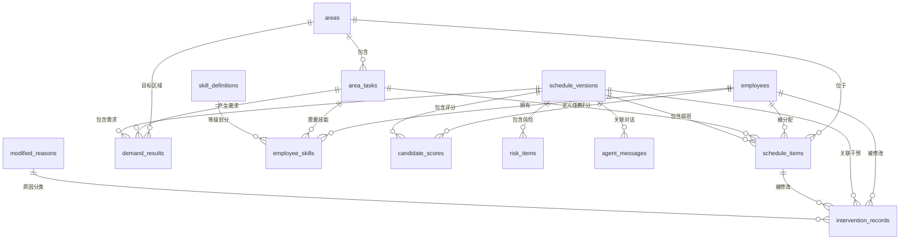

# 智慧排班 Agent — 数据库表结构设计

## 文档信息

| 字段 | 内容 |
| --- | --- |
| 产品名称 | 智慧排班 Agent |
| 数据库类型 | SQLite 3.x |
| 文档版本 | v1.0 |
| 文档状态 | 初稿 |
| 创建日期 | 2026-07-12 |
| 设计原则 | 第三范式 (3NF) + 适度冗余 |
| 字符编码 | UTF-8 |

## 修订历史

| 版本 | 日期 | 修订内容 | 修订人 |
| --- | --- | --- | --- |
| v1.0 | 2026-07-12 | 初始版本 | — |

---

## 1. 设计总览

### 1.1 设计目标

| 目标 | 说明 |
| --- | --- |
| 支持单门店半混班排班闭环 | 存储需求计算、排班生成、风险检测、人工干预全流程数据 |
| 可重置可复现 | Demo 数据可一键重置，相同输入产生相同输出 |
| 可解释性支撑 | 每个排班项和风险都能追溯到员工、规则和数据 |
| 适度冗余提升查询性能 | 姓名等常用字段冗余存储，避免频繁 JOIN |

### 1.2 存储策略

| 数据类型 | 存储媒介 | 生命周期 | 说明 |
| --- | --- | --- | --- |
| 静态种子数据 | CSV / JSON 文件 | 持久（只读） | 区域、员工、技能等配置由文件加载到数据库 |
| 运行时数据 | SQLite 表 | Demo 会话 | 需求结果、排班、风险、干预记录可被重置清空 |
| 字典数据 | SQLite 表（预置） | 持久（只读） | 修改原因等字典数据 |

### 1.3 数据库文件

```
路径: backend/app/data/demo.sqlite
初始化: 首次启动或重置 Demo 时自动创建
重置: POST /api/demo/reset 清空运行时表，重新加载种子数据
```

---

## 2. 实体关系图 (ERD)



### 2.1 表间关系说明

| 主表 | 从表 | 关系 | 外键 | 级联删除 |
| --- | --- | --- | --- | --- |
| areas | area_tasks | 1:N | area_code | CASCADE |
| areas | schedule_items | 1:N | area_code | RESTRICT |
| areas | demand_results | 1:N | area_code | CASCADE |
| employees | employee_skills | 1:N | employee_id | CASCADE |
| employees | schedule_items | 1:N | employee_id | RESTRICT |
| employees | candidate_scores | 1:N | employee_id | CASCADE |
| area_tasks | employee_skills | 1:N | task_code | CASCADE |
| area_tasks | demand_results | 1:N | task_code | CASCADE |
| area_tasks | schedule_items | 1:N | task_code | CASCADE |
| skill_definitions | employee_skills | 1:N | level | RESTRICT |
| schedule_versions | demand_results | 1:N | version_id | CASCADE |
| schedule_versions | schedule_items | 1:N | version_id | CASCADE |
| schedule_versions | candidate_scores | 1:N | version_id | CASCADE |
| schedule_versions | risk_items | 1:N | version_id | CASCADE |
| schedule_versions | intervention_records | 1:N | version_id | CASCADE |
| schedule_versions | agent_messages | 1:N | version_id | CASCADE |
| schedule_items | intervention_records | 1:N | schedule_item_id | CASCADE |
| modified_reasons | intervention_records | 1:N | reason_code | RESTRICT |

---

## 3. 表结构详述

### 3.1 areas — 区域配置表

门店区域定义，如水产区、肉类区、果蔬区等。

| 字段名 | 类型 | 约束 | 默认值 | 说明 |
| --- | --- | --- | --- | --- |
| code | TEXT | PK | — | 区域编码，如 `aquatic` |
| name | TEXT | NOT NULL | — | 显示名称，如 `水产区` |
| allow_mixed | INTEGER | NOT NULL, CHECK(0 or 1) | 1 | 是否允许混排支援 |
| baseline_min | INTEGER | NOT NULL, ≥ 0 | 2 | 保护时段最少保底人数 |
| baseline_max | INTEGER | NOT NULL, ≥ baseline_min | 3 | 保护时段最多保底人数 |
| sort_order | INTEGER | NOT NULL | 0 | 显示排序（升序） |

**索引：** 无（PK 自带索引）

**预置数据：**

| code | name | allow_mixed | baseline_min | baseline_max | sort_order |
| --- | --- | --- | --- | --- | --- |
| aquatic | 水产区 | 0 | 2 | 3 | 1 |
| meat | 肉类区 | 0 | 2 | 3 | 2 |
| produce | 果蔬区 | 1 | 1 | 2 | 3 |
| cashier | 收银/前场 | 1 | 1 | 2 | 4 |
| replenishment | 补货区 | 1 | 1 | 2 | 5 |

---

### 3.2 area_tasks — 区域任务配置表

每个区域下的任务定义，如水产区的杀鱼、称重等。

| 字段名 | 类型 | 约束 | 默认值 | 说明 |
| --- | --- | --- | --- | --- |
| id | TEXT | PK | — | 任务唯一标识，如 `task_aquatic_01` |
| area_code | TEXT | FK → areas(code), NOT NULL | — | 所属区域编码 |
| task_code | TEXT | NOT NULL, UNIQUE(area_code, task_code) | — | 任务编码，如 `fish_butcher` |
| task_name | TEXT | NOT NULL | — | 显示名称，如 `杀鱼` |
| is_professional | INTEGER | NOT NULL, CHECK(0 or 1) | 0 | 是否专业固定岗 |
| min_skill_level | TEXT | FK → skill_definitions(level), NOT NULL | B | 最低技能等级要求 |
| priority | INTEGER | NOT NULL, ≥ 0 | 0 | 分配优先级（越高越优先） |

**索引：**

```sql
CREATE UNIQUE INDEX idx_area_tasks_unique ON area_tasks(area_code, task_code);
CREATE INDEX idx_area_tasks_area ON area_tasks(area_code);
CREATE INDEX idx_area_tasks_professional ON area_tasks(is_professional);
```

**预置数据：**

| area_code | task_code | task_name | is_professional | min_skill_level | priority |
| --- | --- | --- | --- | --- | --- |
| aquatic | fish_butcher | 杀鱼 | 1 | S | 100 |
| aquatic | aquatic_process | 水产处理 | 1 | A | 90 |
| aquatic | weighing | 称重 | 0 | B | 50 |
| aquatic | cleaning | 清洁 | 0 | C | 20 |
| meat | meat_cut | 切肉 | 1 | S | 100 |
| meat | meat_divide | 分割 | 1 | A | 90 |
| meat | weighing | 称重 | 0 | B | 50 |
| meat | display | 陈列 | 0 | B | 40 |
| produce | restock | 补货 | 0 | B | 70 |
| produce | display | 陈列 | 0 | B | 50 |
| produce | packing | 打包 | 0 | B | 40 |
| produce | weighing | 称重 | 0 | B | 50 |
| cashier | cashier | 收银 | 0 | A | 80 |
| cashier | customer_service | 顾客服务 | 0 | B | 40 |
| replenishment | restock_unload | 到货卸货 | 0 | B | 70 |
| replenishment | shelf_restock | 上架补货 | 0 | B | 70 |
| replenishment | inventory | 库存整理 | 0 | B | 40 |

---

### 3.3 skill_definitions — 技能等级定义表

| 字段名 | 类型 | 约束 | 说明 |
| --- | --- | --- | --- |
| level | TEXT | PK, CHECK('S','A','B','C') | 技能等级编码 |
| name | TEXT | NOT NULL | 等级中文名称 |
| description | TEXT | — | 等级描述 |
| can_independent | INTEGER | NOT NULL, CHECK(0 or 1) | 是否可独立上岗 |
| score | REAL | NOT NULL, 0-1 | 评分权重值 |

**预置数据：**

| level | name | description | can_independent | score |
| --- | --- | --- | --- | --- |
| S | 专业师傅 | 可处理高难度专业任务 | 1 | 1.0 |
| A | 熟练员工 | 可独立完成区域常规任务 | 1 | 0.9 |
| B | 可支援员工 | 可在监督下承担基础任务 | 0 | 0.7 |
| C | 新手/临时 | 只能做辅助性工作 | 0 | 0.0 |

---

### 3.4 employees — 员工信息表

| 字段名 | 类型 | 约束 | 默认值 | 说明 |
| --- | --- | --- | --- | --- |
| id | TEXT | PK | — | 员工 ID，格式 `emp_001` |
| name | TEXT | NOT NULL | — | 员工姓名 |
| main_area | TEXT | FK → areas(code) | — | 主区域编码 |
| employee_type | TEXT | NOT NULL, CHECK('professional','regional','mixed','floating') | — | 员工类型 |
| weekly_hours_limit | INTEGER | NOT NULL, > 0 | 40 | 周工时上限（小时） |
| can_mixed | INTEGER | NOT NULL, CHECK(0 or 1) | 0 | 是否可进入混排池 |
| is_active | INTEGER | NOT NULL, CHECK(0 or 1) | 1 | 是否在职 |

**索引：**

```sql
CREATE INDEX idx_employees_main_area ON employees(main_area);
CREATE INDEX idx_employees_type ON employees(employee_type);
CREATE INDEX idx_employees_can_mixed ON employees(can_mixed);
CREATE INDEX idx_employees_active ON employees(is_active);
```

**预置数据：**

| id | name | main_area | employee_type | weekly_hours_limit | can_mixed |
| --- | --- | --- | --- | --- | --- |
| emp_001 | 老王 | aquatic | professional | 40 | 0 |
| emp_002 | 老陈 | aquatic | professional | 40 | 0 |
| emp_003 | 小林 | aquatic | regional | 36 | 1 |
| emp_004 | 老张 | meat | professional | 40 | 0 |
| emp_005 | 老刘 | meat | professional | 40 | 0 |
| emp_006 | 小赵 | meat | regional | 36 | 1 |
| emp_007 | 小李 | produce | mixed | 40 | 1 |
| emp_008 | 小周 | produce | mixed | 40 | 1 |
| emp_009 | 小吴 | cashier | mixed | 36 | 1 |
| emp_010 | 小郑 | cashier | mixed | 36 | 1 |
| emp_011 | 小何 | replenishment | mixed | 40 | 1 |
| emp_012 | 小孙 | replenishment | mixed | 40 | 1 |
| emp_013 | 小唐 | all | floating | 32 | 1 |
| emp_014 | 小马 | all | floating | 28 | 1 |

---

### 3.5 employee_skills — 员工技能映射表

员工与任务、技能等级、区域熟悉度的关联表。

| 字段名 | 类型 | 约束 | 默认值 | 说明 |
| --- | --- | --- | --- | --- |
| id | TEXT | PK | — | 唯一标识 |
| employee_id | TEXT | FK → employees(id), NOT NULL | — | 员工 ID |
| task_code | TEXT | FK → area_tasks(task_code), NOT NULL | — | 任务编码 |
| skill_level | TEXT | FK → skill_definitions(level), NOT NULL | — | 该任务的技能等级 |
| area_familiarity | REAL | NOT NULL, 0-1 | 0.5 | 对关联区域的熟悉度 |

**索引：**

```sql
CREATE INDEX idx_emp_skills_employee ON employee_skills(employee_id);
CREATE INDEX idx_emp_skills_task ON employee_skills(task_code);
CREATE UNIQUE INDEX idx_emp_skills_unique ON employee_skills(employee_id, task_code);
```

**预置数据（部分示例）：**

| employee_id | task_code | skill_level | area_familiarity |
| --- | --- | --- | --- |
| emp_001 | fish_butcher | S | 1.0 |
| emp_001 | aquatic_process | S | 1.0 |
| emp_001 | weighing | A | 0.9 |
| emp_004 | meat_cut | S | 1.0 |
| emp_004 | meat_divide | S | 1.0 |
| emp_004 | weighing | A | 0.8 |
| emp_013 | cashier | A | 0.9 |
| emp_013 | restock | A | 0.8 |
| emp_013 | produce_display | A | 0.8 |
| emp_013 | packing | A | 0.9 |

---

### 3.6 schedule_versions — 排班版本表

每次生成排班创建一个版本。

| 字段名 | 类型 | 约束 | 默认值 | 说明 |
| --- | --- | --- | --- | --- |
| id | TEXT | PK | — | 版本 ID，格式 `sch_{uuid_short}` |
| store_id | TEXT | NOT NULL | — | 门店 ID |
| week_start | TEXT | NOT NULL | — | 排班周起始日期 YYYY-MM-DD |
| status | TEXT | NOT NULL, CHECK('generated','confirmed') | 'generated' | 版本状态 |
| created_at | TEXT | NOT NULL | — | 创建时间 ISO 8601 |
| updated_at | TEXT | — | — | 最后更新时间 |
| agent_summary | TEXT | — | — | Agent 排班摘要 |

**索引：**

```sql
CREATE INDEX idx_schedule_versions_store_week ON schedule_versions(store_id, week_start);
CREATE INDEX idx_schedule_versions_status ON schedule_versions(status);
```

---

### 3.7 demand_results — 需求计算结果表

每次排班生成时，记录完整的需求计算结果。

| 字段名 | 类型 | 约束 | 说明 |
| --- | --- | --- | --- |
| id | TEXT | PK | 唯一标识 |
| version_id | TEXT | FK → schedule_versions(id), NOT NULL | 排班版本 ID |
| date | TEXT | NOT NULL | 日期 YYYY-MM-DD |
| weekday | TEXT | NOT NULL | 星期英文 |
| slot | TEXT | NOT NULL | 时段，如 `17:00-19:00` |
| area_code | TEXT | FK → areas(code), NOT NULL | 区域编码 |
| task_code | TEXT | FK → area_tasks(task_code), NOT NULL | 任务编码 |
| required_count | INTEGER | NOT NULL, ≥ 0 | 需求人数 |
| demand_score | REAL | NOT NULL, 0-100 | 需求强度 |
| demand_factors | TEXT | NOT NULL | JSON 数组，如 `["晚高峰","周五","降雨"]` |
| priority | TEXT | NOT NULL, CHECK('high','normal','low') | 优先级 |
| confidence | TEXT | NOT NULL, CHECK('high','medium','low') | 置信度 |
| is_protected | INTEGER | NOT NULL, CHECK(0 or 1) | 是否保护时段 |

**索引：**

```sql
CREATE INDEX idx_demand_version ON demand_results(version_id);
CREATE INDEX idx_demand_area_slot ON demand_results(area_code, slot);
CREATE INDEX idx_demand_date ON demand_results(date);
CREATE INDEX idx_demand_priority ON demand_results(priority);
```

---

### 3.8 schedule_items — 排班项表

排班结果的核心表，每条记录为一个员工在一个时段的一个任务分配。

| 字段名 | 类型 | 约束 | 默认值 | 说明 |
| --- | --- | --- | --- | --- |
| id | TEXT | PK | — | 排班项 ID，格式 `si_{uuid_short}` |
| version_id | TEXT | FK → schedule_versions(id), NOT NULL | — | 排班版本 ID |
| date | TEXT | NOT NULL | — | 日期 |
| slot | TEXT | NOT NULL | — | 时段 |
| area_code | TEXT | FK → areas(code), NOT NULL | — | 区域编码 |
| task_code | TEXT | FK → area_tasks(task_code), NOT NULL | — | 任务编码 |
| employee_id | TEXT | FK → employees(id), NOT NULL | — | 员工 ID |
| employee_name | TEXT | NOT NULL | — | 员工姓名（冗余，方便展示） |
| assignment_type | TEXT | NOT NULL, CHECK('fixed','regional','mixed') | — | 分配类型 |
| is_protected | INTEGER | NOT NULL, CHECK(0 or 1) | 0 | 是否保护时段 |
| risk_level | TEXT | NOT NULL, CHECK('none','info','warning','critical') | 'none' | 风险等级 |
| explanation | TEXT | — | — | 排班解释 |
| source | TEXT | NOT NULL, CHECK('system','manual') | 'system' | 来源 |

**索引：**

```sql
CREATE INDEX idx_schedule_items_version ON schedule_items(version_id);
CREATE INDEX idx_schedule_items_employee ON schedule_items(employee_id);
CREATE INDEX idx_schedule_items_date_area ON schedule_items(date, area_code);
CREATE INDEX idx_schedule_items_type ON schedule_items(assignment_type);
CREATE INDEX idx_schedule_items_risk ON schedule_items(risk_level);
```

---

### 3.9 candidate_scores — 候选人评分表

记录每个缺口对应的候选人评分详情，用于 Agent 解释。

| 字段名 | 类型 | 约束 | 默认值 | 说明 |
| --- | --- | --- | --- | --- |
| id | TEXT | PK | — | 唯一标识 |
| version_id | TEXT | FK → schedule_versions(id), NOT NULL | — | 排班版本 ID |
| gap_key | TEXT | NOT NULL | — | 缺口标识 `{date}_{slot}_{area_code}_{task_code}` |
| employee_id | TEXT | FK → employees(id), NOT NULL | — | 员工 ID |
| total_score | REAL | NOT NULL, 0-100 | — | 综合得分 |
| skill_score | REAL | NOT NULL, 0-35 | — | 技能匹配分 |
| familiarity_score | REAL | NOT NULL, 0-20 | — | 区域熟悉度分 |
| hours_score | REAL | NOT NULL, 0-15 | — | 剩余工时分 |
| peak_score | REAL | NOT NULL, 0-10 | — | 高峰适配分 |
| area_impact_score | REAL | NOT NULL, 0-15 | — | 主区域不受影响分 |
| preference_score | REAL | NOT NULL, 0-5 | — | 偏好匹配分 |
| risk_deduction | REAL | NOT NULL, ≥ 0 | 0 | 风险扣分 |
| reason | TEXT | — | — | 推荐/不推荐原因 |
| is_recommended | INTEGER | NOT NULL, CHECK(0 or 1) | 0 | 是否被系统推荐 |

**索引：**

```sql
CREATE INDEX idx_candidate_version ON candidate_scores(version_id);
CREATE INDEX idx_candidate_gap ON candidate_scores(gap_key);
CREATE INDEX idx_candidate_employee ON candidate_scores(employee_id);
```

---

### 3.10 risk_items — 风险项表

| 字段名 | 类型 | 约束 | 默认值 | 说明 |
| --- | --- | --- | --- | --- |
| id | TEXT | PK | — | 风险 ID |
| version_id | TEXT | FK → schedule_versions(id), NOT NULL | — | 排班版本 ID |
| type | TEXT | NOT NULL, CHECK('professional_gap','baseline_shortage','peak_gap','skill_mismatch','overtime','mixed_overuse') | — | 风险类型 |
| level | TEXT | NOT NULL, CHECK('critical','warning','info') | — | 风险等级 |
| description | TEXT | NOT NULL | — | 风险描述 |
| affected_item_ids | TEXT | — | — | JSON 数组，影响排班项 ID |
| suggestion | TEXT | — | — | 处理建议 |
| created_at | TEXT | NOT NULL | — | 创建时间 ISO 8601 |

**索引：**

```sql
CREATE INDEX idx_risk_version ON risk_items(version_id);
CREATE INDEX idx_risk_level ON risk_items(level);
CREATE INDEX idx_risk_type ON risk_items(type);
```

---

### 3.11 intervention_records — 人工干预记录表

| 字段名 | 类型 | 约束 | 说明 |
| --- | --- | --- | --- |
| id | TEXT | PK | 干预记录 ID |
| version_id | TEXT | FK → schedule_versions(id), NOT NULL | 排班版本 ID |
| schedule_item_id | TEXT | FK → schedule_items(id), NOT NULL | 被修改的排班项 ID |
| before_employee_id | TEXT | — | 修改前员工 ID |
| before_area_code | TEXT | — | 修改前区域编码 |
| before_task_code | TEXT | — | 修改前任务编码 |
| after_employee_id | TEXT | — | 修改后员工 ID |
| after_area_code | TEXT | — | 修改后区域编码 |
| after_task_code | TEXT | — | 修改后任务编码 |
| reason_code | TEXT | FK → modified_reasons(code), NOT NULL | 原因编码 |
| reason_text | TEXT | — | 原因说明（reason_code 为 other 时必填） |
| created_at | TEXT | NOT NULL | 修改时间 ISO 8601 |

**索引：**

```sql
CREATE INDEX idx_intervention_version ON intervention_records(version_id);
CREATE INDEX idx_intervention_item ON intervention_records(schedule_item_id);
CREATE INDEX idx_intervention_reason ON intervention_records(reason_code);
CREATE INDEX idx_intervention_created ON intervention_records(created_at);
```

---

### 3.12 agent_messages — Agent 问答记录表

| 字段名 | 类型 | 约束 | 说明 |
| --- | --- | --- | --- |
| id | TEXT | PK | 消息 ID |
| version_id | TEXT | FK → schedule_versions(id), NOT NULL | 排班版本 ID |
| user_message | TEXT | NOT NULL | 用户输入原文 |
| agent_response | TEXT | NOT NULL | Agent 响应 JSON |
| intent | TEXT | — | 识别到的意图 |
| llm_latency_ms | INTEGER | — | LLM 调用耗时（毫秒） |
| is_fallback | INTEGER | NOT NULL, CHECK(0 or 1) | 0 | 是否降级模式 |
| created_at | TEXT | NOT NULL | 创建时间 |

**索引：**

```sql
CREATE INDEX idx_agent_version ON agent_messages(version_id);
CREATE INDEX idx_agent_intent ON agent_messages(intent);
CREATE INDEX idx_agent_created ON agent_messages(created_at);
```

---

### 3.13 modified_reasons — 修改原因字典表

| 字段名 | 类型 | 约束 | 说明 |
| --- | --- | --- | --- |
| code | TEXT | PK | 原因编码，如 `manager_experience` |
| label | TEXT | NOT NULL | 显示名称，如 `店长经验调整` |
| sort_order | INTEGER | NOT NULL | 0 | 显示排序（升序） |

**预置数据：**

| code | label | sort_order |
| --- | --- | --- |
| employee_unavailable | 员工实际不可用 | 1 |
| employee_not_fit | 员工不适合该区域 | 2 |
| manager_experience | 店长经验调整 | 3 |
| area_leader_request | 区域负责人要求 | 4 |
| operation_change | 临时经营变化 | 5 |
| other | 其他 | 6 |

---

### 3.14 protected_slots — 保护时段配置表

用于配置各区域的保护时段规则。预留扩展表，当前可由应用层代码加载。

| 字段名 | 类型 | 约束 | 说明 |
| --- | --- | --- | --- |
| id | TEXT | PK | 唯一标识 |
| area_code | TEXT | FK → areas(code), NOT NULL | 区域编码 |
| start_time | TEXT | NOT NULL | 开始时间 HH:mm |
| end_time | TEXT | NOT NULL | 结束时间 HH:mm |
| weekdays | TEXT | NOT NULL | 适用星期 JSON 数组 |
| description | TEXT | — | 时段说明 |

**预置数据：**

| area_code | start_time | end_time | weekdays | description |
| --- | --- | --- | --- | --- |
| aquatic | 08:00 | 11:00 | ["Monday","Tuesday","Wednesday","Thursday","Friday","Saturday","Sunday"] | 水产早市高峰 |
| aquatic | 17:00 | 19:00 | ["Monday","Tuesday","Wednesday","Thursday","Friday","Saturday","Sunday"] | 水产晚高峰 |
| meat | 08:00 | 11:00 | ["Monday","Tuesday","Wednesday","Thursday","Friday","Saturday","Sunday"] | 肉类早市高峰 |
| meat | 17:00 | 19:00 | ["Monday","Tuesday","Wednesday","Thursday","Friday","Saturday","Sunday"] | 肉类晚高峰 |
| produce | 17:00 | 20:00 | ["Monday","Tuesday","Wednesday","Thursday","Friday","Saturday","Sunday"] | 果蔬晚高峰 |
| cashier | 11:00 | 13:00 | ["Monday","Tuesday","Wednesday","Thursday","Friday","Saturday","Sunday"] | 收银午高峰 |
| cashier | 17:00 | 20:00 | ["Monday","Tuesday","Wednesday","Thursday","Friday","Saturday","Sunday"] | 收银晚高峰 |
| replenishment | 09:00 | 12:00 | ["Monday","Tuesday","Wednesday","Thursday","Friday","Saturday","Sunday"] | 补货早高峰 |

---

## 4. DDL 完整脚本

```sql
-- ============================================
-- 智慧排班 Agent 数据库 DDL
-- 数据库: SQLite 3.x
-- ============================================

-- 开启外键约束
PRAGMA foreign_keys = ON;

-- ============================================
-- 4.1 区域配置表
-- ============================================
CREATE TABLE IF NOT EXISTS areas (
    code TEXT PRIMARY KEY,
    name TEXT NOT NULL,
    allow_mixed INTEGER NOT NULL CHECK(allow_mixed IN (0, 1)) DEFAULT 1,
    baseline_min INTEGER NOT NULL CHECK(baseline_min >= 0) DEFAULT 2,
    baseline_max INTEGER NOT NULL CHECK(baseline_max >= baseline_min) DEFAULT 3,
    sort_order INTEGER NOT NULL DEFAULT 0
);

-- ============================================
-- 4.2 区域任务配置表
-- ============================================
CREATE TABLE IF NOT EXISTS area_tasks (
    id TEXT PRIMARY KEY,
    area_code TEXT NOT NULL REFERENCES areas(code) ON DELETE CASCADE,
    task_code TEXT NOT NULL,
    task_name TEXT NOT NULL,
    is_professional INTEGER NOT NULL CHECK(is_professional IN (0, 1)) DEFAULT 0,
    min_skill_level TEXT NOT NULL REFERENCES skill_definitions(level) DEFAULT 'B',
    priority INTEGER NOT NULL CHECK(priority >= 0) DEFAULT 0
);
CREATE UNIQUE INDEX IF NOT EXISTS idx_area_tasks_unique ON area_tasks(area_code, task_code);
CREATE INDEX IF NOT EXISTS idx_area_tasks_area ON area_tasks(area_code);
CREATE INDEX IF NOT EXISTS idx_area_tasks_professional ON area_tasks(is_professional);

-- ============================================
-- 4.3 技能等级定义表
-- ============================================
CREATE TABLE IF NOT EXISTS skill_definitions (
    level TEXT PRIMARY KEY CHECK(level IN ('S', 'A', 'B', 'C')),
    name TEXT NOT NULL,
    description TEXT,
    can_independent INTEGER NOT NULL CHECK(can_independent IN (0, 1)),
    score REAL NOT NULL CHECK(score >= 0 AND score <= 1)
);

-- ============================================
-- 4.4 员工信息表
-- ============================================
CREATE TABLE IF NOT EXISTS employees (
    id TEXT PRIMARY KEY,
    name TEXT NOT NULL,
    main_area TEXT REFERENCES areas(code),
    employee_type TEXT NOT NULL CHECK(employee_type IN ('professional', 'regional', 'mixed', 'floating')),
    weekly_hours_limit INTEGER NOT NULL CHECK(weekly_hours_limit > 0) DEFAULT 40,
    can_mixed INTEGER NOT NULL CHECK(can_mixed IN (0, 1)) DEFAULT 0,
    is_active INTEGER NOT NULL CHECK(is_active IN (0, 1)) DEFAULT 1
);
CREATE INDEX IF NOT EXISTS idx_employees_main_area ON employees(main_area);
CREATE INDEX IF NOT EXISTS idx_employees_type ON employees(employee_type);
CREATE INDEX IF NOT EXISTS idx_employees_can_mixed ON employees(can_mixed);
CREATE INDEX IF NOT EXISTS idx_employees_active ON employees(is_active);

-- ============================================
-- 4.5 员工技能映射表
-- ============================================
CREATE TABLE IF NOT EXISTS employee_skills (
    id TEXT PRIMARY KEY,
    employee_id TEXT NOT NULL REFERENCES employees(id) ON DELETE CASCADE,
    task_code TEXT NOT NULL REFERENCES area_tasks(task_code) ON DELETE CASCADE,
    skill_level TEXT NOT NULL REFERENCES skill_definitions(level),
    area_familiarity REAL NOT NULL CHECK(area_familiarity >= 0 AND area_familiarity <= 1) DEFAULT 0.5
);
CREATE INDEX IF NOT EXISTS idx_emp_skills_employee ON employee_skills(employee_id);
CREATE INDEX IF NOT EXISTS idx_emp_skills_task ON employee_skills(task_code);
CREATE UNIQUE INDEX IF NOT EXISTS idx_emp_skills_unique ON employee_skills(employee_id, task_code);

-- ============================================
-- 4.6 排班版本表
-- ============================================
CREATE TABLE IF NOT EXISTS schedule_versions (
    id TEXT PRIMARY KEY,
    store_id TEXT NOT NULL,
    week_start TEXT NOT NULL,
    status TEXT NOT NULL CHECK(status IN ('generated', 'confirmed')) DEFAULT 'generated',
    created_at TEXT NOT NULL DEFAULT (datetime('now')),
    updated_at TEXT,
    agent_summary TEXT
);
CREATE INDEX IF NOT EXISTS idx_schedule_versions_store_week ON schedule_versions(store_id, week_start);
CREATE INDEX IF NOT EXISTS idx_schedule_versions_status ON schedule_versions(status);

-- ============================================
-- 4.7 需求计算结果表
-- ============================================
CREATE TABLE IF NOT EXISTS demand_results (
    id TEXT PRIMARY KEY,
    version_id TEXT NOT NULL REFERENCES schedule_versions(id) ON DELETE CASCADE,
    date TEXT NOT NULL,
    weekday TEXT NOT NULL,
    slot TEXT NOT NULL,
    area_code TEXT NOT NULL REFERENCES areas(code) ON DELETE CASCADE,
    task_code TEXT NOT NULL REFERENCES area_tasks(task_code) ON DELETE CASCADE,
    required_count INTEGER NOT NULL CHECK(required_count >= 0),
    demand_score REAL NOT NULL CHECK(demand_score >= 0 AND demand_score <= 100),
    demand_factors TEXT NOT NULL,
    priority TEXT NOT NULL CHECK(priority IN ('high', 'normal', 'low')),
    confidence TEXT NOT NULL CHECK(confidence IN ('high', 'medium', 'low')),
    is_protected INTEGER NOT NULL CHECK(is_protected IN (0, 1)) DEFAULT 0
);
CREATE INDEX IF NOT EXISTS idx_demand_version ON demand_results(version_id);
CREATE INDEX IF NOT EXISTS idx_demand_area_slot ON demand_results(area_code, slot);
CREATE INDEX IF NOT EXISTS idx_demand_date ON demand_results(date);
CREATE INDEX IF NOT EXISTS idx_demand_priority ON demand_results(priority);

-- ============================================
-- 4.8 排班项表
-- ============================================
CREATE TABLE IF NOT EXISTS schedule_items (
    id TEXT PRIMARY KEY,
    version_id TEXT NOT NULL REFERENCES schedule_versions(id) ON DELETE CASCADE,
    date TEXT NOT NULL,
    slot TEXT NOT NULL,
    area_code TEXT NOT NULL REFERENCES areas(code),
    task_code TEXT NOT NULL REFERENCES area_tasks(task_code),
    employee_id TEXT NOT NULL REFERENCES employees(id),
    employee_name TEXT NOT NULL,
    assignment_type TEXT NOT NULL CHECK(assignment_type IN ('fixed', 'regional', 'mixed')),
    is_protected INTEGER NOT NULL CHECK(is_protected IN (0, 1)) DEFAULT 0,
    risk_level TEXT NOT NULL CHECK(risk_level IN ('none', 'info', 'warning', 'critical')) DEFAULT 'none',
    explanation TEXT,
    source TEXT NOT NULL CHECK(source IN ('system', 'manual')) DEFAULT 'system'
);
CREATE INDEX IF NOT EXISTS idx_schedule_items_version ON schedule_items(version_id);
CREATE INDEX IF NOT EXISTS idx_schedule_items_employee ON schedule_items(employee_id);
CREATE INDEX IF NOT EXISTS idx_schedule_items_date_area ON schedule_items(date, area_code);
CREATE INDEX IF NOT EXISTS idx_schedule_items_type ON schedule_items(assignment_type);
CREATE INDEX IF NOT EXISTS idx_schedule_items_risk ON schedule_items(risk_level);

-- ============================================
-- 4.9 候选人评分表
-- ============================================
CREATE TABLE IF NOT EXISTS candidate_scores (
    id TEXT PRIMARY KEY,
    version_id TEXT NOT NULL REFERENCES schedule_versions(id) ON DELETE CASCADE,
    gap_key TEXT NOT NULL,
    employee_id TEXT NOT NULL REFERENCES employees(id) ON DELETE CASCADE,
    total_score REAL NOT NULL CHECK(total_score >= 0 AND total_score <= 100),
    skill_score REAL NOT NULL CHECK(skill_score >= 0 AND skill_score <= 35),
    familiarity_score REAL NOT NULL CHECK(familiarity_score >= 0 AND familiarity_score <= 20),
    hours_score REAL NOT NULL CHECK(hours_score >= 0 AND hours_score <= 15),
    peak_score REAL NOT NULL CHECK(peak_score >= 0 AND peak_score <= 10),
    area_impact_score REAL NOT NULL CHECK(area_impact_score >= 0 AND area_impact_score <= 15),
    preference_score REAL NOT NULL CHECK(preference_score >= 0 AND preference_score <= 5),
    risk_deduction REAL NOT NULL CHECK(risk_deduction >= 0) DEFAULT 0,
    reason TEXT,
    is_recommended INTEGER NOT NULL CHECK(is_recommended IN (0, 1)) DEFAULT 0
);
CREATE INDEX IF NOT EXISTS idx_candidate_version ON candidate_scores(version_id);
CREATE INDEX IF NOT EXISTS idx_candidate_gap ON candidate_scores(gap_key);
CREATE INDEX IF NOT EXISTS idx_candidate_employee ON candidate_scores(employee_id);

-- ============================================
-- 4.10 风险项表
-- ============================================
CREATE TABLE IF NOT EXISTS risk_items (
    id TEXT PRIMARY KEY,
    version_id TEXT NOT NULL REFERENCES schedule_versions(id) ON DELETE CASCADE,
    type TEXT NOT NULL CHECK(type IN ('professional_gap', 'baseline_shortage', 'peak_gap', 'skill_mismatch', 'overtime', 'mixed_overuse')),
    level TEXT NOT NULL CHECK(level IN ('critical', 'warning', 'info')),
    description TEXT NOT NULL,
    affected_item_ids TEXT,
    suggestion TEXT,
    created_at TEXT NOT NULL DEFAULT (datetime('now'))
);
CREATE INDEX IF NOT EXISTS idx_risk_version ON risk_items(version_id);
CREATE INDEX IF NOT EXISTS idx_risk_level ON risk_items(level);
CREATE INDEX IF NOT EXISTS idx_risk_type ON risk_items(type);

-- ============================================
-- 4.11 人工干预记录表
-- ============================================
CREATE TABLE IF NOT EXISTS intervention_records (
    id TEXT PRIMARY KEY,
    version_id TEXT NOT NULL REFERENCES schedule_versions(id) ON DELETE CASCADE,
    schedule_item_id TEXT NOT NULL REFERENCES schedule_items(id) ON DELETE CASCADE,
    before_employee_id TEXT,
    before_area_code TEXT,
    before_task_code TEXT,
    after_employee_id TEXT,
    after_area_code TEXT,
    after_task_code TEXT,
    reason_code TEXT NOT NULL REFERENCES modified_reasons(code),
    reason_text TEXT,
    created_at TEXT NOT NULL DEFAULT (datetime('now'))
);
CREATE INDEX IF NOT EXISTS idx_intervention_version ON intervention_records(version_id);
CREATE INDEX IF NOT EXISTS idx_intervention_item ON intervention_records(schedule_item_id);
CREATE INDEX IF NOT EXISTS idx_intervention_reason ON intervention_records(reason_code);
CREATE INDEX IF NOT EXISTS idx_intervention_created ON intervention_records(created_at);

-- ============================================
-- 4.12 Agent 问答记录表
-- ============================================
CREATE TABLE IF NOT EXISTS agent_messages (
    id TEXT PRIMARY KEY,
    version_id TEXT NOT NULL REFERENCES schedule_versions(id) ON DELETE CASCADE,
    user_message TEXT NOT NULL,
    agent_response TEXT NOT NULL,
    intent TEXT,
    llm_latency_ms INTEGER,
    is_fallback INTEGER NOT NULL CHECK(is_fallback IN (0, 1)) DEFAULT 0,
    created_at TEXT NOT NULL DEFAULT (datetime('now'))
);
CREATE INDEX IF NOT EXISTS idx_agent_version ON agent_messages(version_id);
CREATE INDEX IF NOT EXISTS idx_agent_intent ON agent_messages(intent);
CREATE INDEX IF NOT EXISTS idx_agent_created ON agent_messages(created_at);

-- ============================================
-- 4.13 修改原因字典表
-- ============================================
CREATE TABLE IF NOT EXISTS modified_reasons (
    code TEXT PRIMARY KEY,
    label TEXT NOT NULL,
    sort_order INTEGER NOT NULL DEFAULT 0
);

-- ============================================
-- 4.14 保护时段配置表
-- ============================================
CREATE TABLE IF NOT EXISTS protected_slots (
    id TEXT PRIMARY KEY,
    area_code TEXT NOT NULL REFERENCES areas(code) ON DELETE CASCADE,
    start_time TEXT NOT NULL,
    end_time TEXT NOT NULL,
    weekdays TEXT NOT NULL,
    description TEXT
);
CREATE INDEX IF NOT EXISTS idx_protected_slots_area ON protected_slots(area_code);
```

---

---

---

## 7. 数据初始化脚本

### 7.1 种子数据加载顺序

```text
1. skill_definitions      ← 无依赖
2. areas                  ← 无依赖
3. modified_reasons       ← 无依赖
4. area_tasks             ← 依赖 areas, skill_definitions
5. employees              ← 依赖 areas
6. employee_skills        ← 依赖 employees, area_tasks, skill_definitions
7. protected_slots        ← 依赖 areas
```

### 7.2 插入种子数据 SQL

```sql
-- 技能等级
INSERT INTO skill_definitions VALUES ('S', '专业师傅', '可处理高难度专业任务', 1, 1.0);
INSERT INTO skill_definitions VALUES ('A', '熟练员工', '可独立完成区域常规任务', 1, 0.9);
INSERT INTO skill_definitions VALUES ('B', '可支援员工', '可在监督下承担基础任务', 0, 0.7);
INSERT INTO skill_definitions VALUES ('C', '新手/临时', '只能做辅助性工作', 0, 0.0);

-- 区域
INSERT INTO areas VALUES ('aquatic', '水产区', 0, 2, 3, 1);
INSERT INTO areas VALUES ('meat', '肉类区', 0, 2, 3, 2);
INSERT INTO areas VALUES ('produce', '果蔬区', 1, 1, 2, 3);
INSERT INTO areas VALUES ('cashier', '收银/前场', 1, 1, 2, 4);
INSERT INTO areas VALUES ('replenishment', '补货区', 1, 1, 2, 5);

-- 修改原因
INSERT INTO modified_reasons VALUES ('employee_unavailable', '员工实际不可用', 1);
INSERT INTO modified_reasons VALUES ('employee_not_fit', '员工不适合该区域', 2);
INSERT INTO modified_reasons VALUES ('manager_experience', '店长经验调整', 3);
INSERT INTO modified_reasons VALUES ('area_leader_request', '区域负责人要求', 4);
INSERT INTO modified_reasons VALUES ('operation_change', '临时经营变化', 5);
INSERT INTO modified_reasons VALUES ('other', '其他', 6);
```

### 7.3 重置数据 SQL

```sql
-- 清空运行时表（保留种子数据）
DELETE FROM agent_messages;
DELETE FROM intervention_records;
DELETE FROM candidate_scores;
DELETE FROM risk_items;
DELETE FROM schedule_items;
DELETE FROM schedule_versions;
DELETE FROM demand_results;
```

---

---


