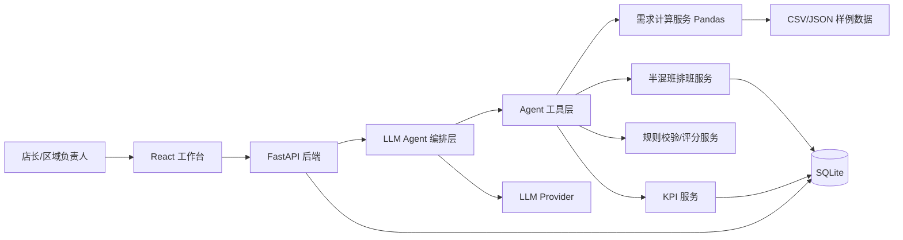
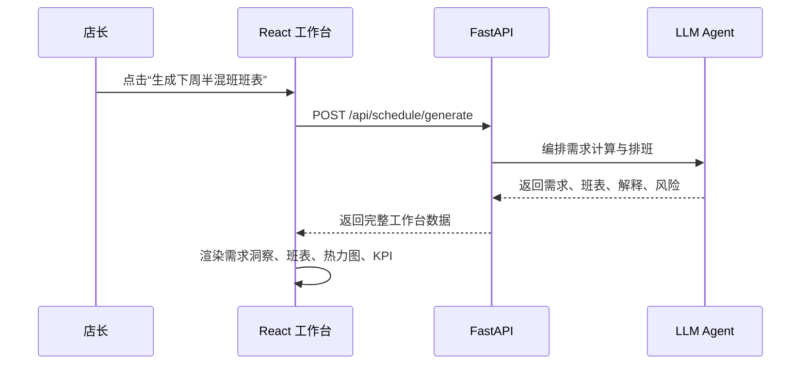
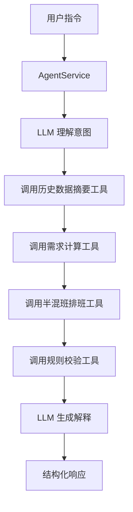
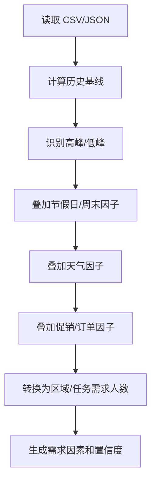
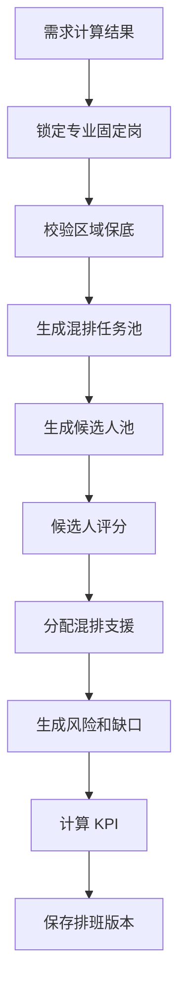
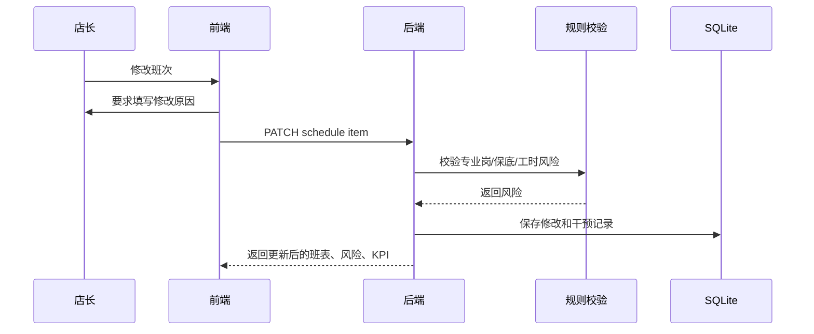

# 智慧排班 Agent 半混班 Demo 架构设计文档（终版）

## 1. 文档信息

| 字段 | 内容 |
| --- | --- |
| 产品名称 | 智慧排班 Agent |
| 对应 PRD | `smart-scheduling-agent-semi-mixed-prd-final.md` |
| 对应技术选型 | `技术选型-半混班Demo终版.md` |
| 文档版本 | v1.2 |
| 文档状态 | 研发交付终版 |
| 创建日期 | 2026-07-11 |

## 2. 架构目标

本架构面向单门店半混班智能排班 Demo，支撑以下核心能力：

1. 基于历史销售、客流、订单、节假日、天气、促销等数据计算分时段用工需求。
2. 由 LLM Agent 编排需求计算、半混班排班、风险解释和调整建议。
3. 在专业岗稳定、区域保底和混排池补位规则下生成一周班表。
4. 展示需求依据、排班依据、风险提示和人工干预记录。
5. 支持本地样例数据闭环演示和一键重置。

## 3. 架构原则

| 原则 | 说明 |
| --- | --- |
| 单门店闭环 | 围绕一个门店完成历史数据、需求计算、排班生成和解释闭环 |
| LLM 编排 | LLM Agent 负责理解意图、综合因素、生成策略和组织解释 |
| 确定性计算 | 数值聚合、规则校验、候选人评分、KPI 由 Python 模块计算 |
| 本地持久化 | 历史样例数据使用 CSV/JSON，运行结果使用 SQLite |
| 可解释优先 | 每个需求和排班结果都能追溯到数据、规则和评分依据 |
| 演示稳定 | Demo 数据可重置，核心链路结果可复现 |

## 4. 总体架构



## 5. 系统边界

### 5.1 本期系统能力

- 单门店历史样例数据管理。
- 需求计算。
- LLM Agent 编排。
- 半混班排班。
- 专业岗锁定。
- 区域保底校验。
- 混排池补位。
- 风险提示。
- KPI 计算。
- 人工干预记录。
- SQLite 本地持久化。

### 5.2 外部依赖

| 类型 | 说明 |
| --- | --- |
| LLM Provider | 提供自然语言理解、策略组织和解释生成能力 |
| 本地样例数据 | CSV/JSON 文件，承载历史经营和门店基础数据 |

## 6. 前端架构

### 6.1 页面结构

```text
SemiMixedSchedulingWorkbench
  ├── HeaderBar
  │   ├── StoreInfo
  │   ├── WeekSelector
  │   ├── GenerateWithAgentButton
  │   └── ResetDemoButton
  ├── DemandInsightPanel
  ├── KpiCards
  ├── AreaBaselinePanel
  ├── WeeklyScheduleBoard
  ├── DemandGapHeatmap
  ├── AgentPanel
  └── InterventionDrawer
```

### 6.2 组件职责

| 组件 | 职责 |
| --- | --- |
| `HeaderBar` | 展示门店、排班周、生成和重置操作 |
| `DemandInsightPanel` | 展示高峰/低峰、节假日、天气、促销等需求因素 |
| `KpiCards` | 展示专业岗覆盖率、区域保底达成率、混排利用率、人工干预率、高峰缺口数 |
| `AreaBaselinePanel` | 展示各区域保底、已排、缺口和风险 |
| `WeeklyScheduleBoard` | 展示 7 天排班和专业/混排标签 |
| `DemandGapHeatmap` | 展示区域 x 时段需求、已排、缺口 |
| `AgentPanel` | 展示 Agent 对话、需求解释、候选推荐和不可调解释 |
| `InterventionDrawer` | 展示人工修改记录和干预原因 |

### 6.3 前端数据流



## 7. 后端架构

### 7.1 目录结构

```text
backend/
  app/
    main.py
    api/
      schedule_api.py
      agent_api.py
      demo_api.py
    schemas/
      demand.py
      schedule.py
      agent.py
      employee.py
    services/
      demand_service.py
      schedule_service.py
      kpi_service.py
      intervention_service.py
    agent/
      agent_service.py
      provider.py
      prompts.py
      tools.py
      structured_outputs.py
    scheduling/
      generator.py
      rules.py
      scorer.py
      risks.py
    data/
      seed_loader.py
      sqlite_store.py
    seed/
      employees.json
      areas.json
      historical_sales.csv
      historical_traffic.csv
      online_orders.csv
      weather.csv
      holidays.csv
```

### 7.2 模块职责

| 模块 | 职责 |
| --- | --- |
| API 层 | 接收前端请求，返回工作台数据 |
| AgentService | 调用 LLM，编排需求计算、排班、解释 |
| DemandService | 用 Pandas 聚合历史数据并生成用工需求 |
| ScheduleService | 生成和保存排班版本 |
| SchedulingGenerator | 执行半混班排班规则 |
| RuleService | 专业岗、保护时段、区域保底、工时等规则校验 |
| CandidateScorer | 计算混排候选人得分 |
| RiskService | 生成风险和不可调原因 |
| KpiService | 计算 KPI |
| InterventionService | 记录人工修改和干预率 |
| SQLiteStore | 本地持久化 |
| SeedLoader | 加载和重置样例数据 |

## 8. LLM Agent 架构

### 8.1 Agent 职责

Agent 是系统的智能编排层，负责：

- 理解“生成下周半混班班表”等自然语言指令。
- 读取历史数据摘要。
- 判断需求受哪些因素影响。
- 调用需求计算工具。
- 调用半混班排班工具。
- 调用风险校验工具。
- 组织最终解释。

### 8.2 Agent 工具

| 工具 | 输入 | 输出 |
| --- | --- | --- |
| `get_historical_summary` | 门店、日期范围 | 历史销售/客流/订单摘要 |
| `calculate_demand` | 历史摘要、天气、节假日、促销 | 分时段区域/任务需求 |
| `generate_schedule` | 需求、员工、技能、半混班规则 | 排班结果 |
| `validate_schedule` | 排班结果 | 风险和不可调原因 |
| `recommend_support` | 缺口、候选人池 | 支援候选人 |
| `record_intervention` | 修改前后、原因 | 干预记录 |

### 8.3 Agent 数据流



### 8.4 结构化输出

Agent 输出通过 Pydantic 校验：

```json
{
  "intent": "generate_schedule",
  "summary": "已根据历史客流、周五晚高峰和天气因素生成下周半混班班表。",
  "demand_reasoning": [
    "周五 17:00-19:00 历史客流高于均值 28%",
    "降雨会提高线上订单和打包任务需求"
  ],
  "schedule_highlights": [
    "老王、老陈锁定水产保护时段",
    "小唐支援周五晚高峰果蔬"
  ],
  "risks": [],
  "next_actions": ["查看周五晚高峰缺口", "确认混排支援安排"]
}
```

## 9. 需求计算架构

### 9.1 输入数据

| 数据 | 文件示例 | 用途 |
| --- | --- | --- |
| 历史销售 | `historical_sales.csv` | 区域销售压力 |
| 历史客流 | `historical_traffic.csv` | 高峰/低峰识别 |
| 线上订单 | `online_orders.csv` | 拣货、打包、补货需求 |
| 天气 | `weather.csv` | 雨天、温度对需求的影响 |
| 节假日 | `holidays.csv` | 节假日/周末上浮 |
| 员工 | `employees.json` | 技能、工时、主区域 |
| 区域任务 | `areas.json` | 专业岗、保护时段、混排规则 |

### 9.2 计算流程



### 9.3 需求输出

| 字段 | 说明 |
| --- | --- |
| date | 日期 |
| slot | 时段 |
| area_code | 区域 |
| task_code | 任务 |
| required_count | 需求人数 |
| demand_score | 需求强度 |
| demand_factors | 需求因素 |
| confidence | 置信度 |

## 10. 半混班排班架构

### 10.1 排班流程



### 10.2 规则顺序

1. 专业岗资质。
2. 保护时段。
3. 区域保底。
4. 员工可用性。
5. 周工时上限。
6. 混排技能匹配。
7. 区域熟悉度。
8. 工时均衡。
9. 员工偏好。

### 10.3 候选人评分

```text
候选人得分 =
  技能匹配分 * 35
+ 区域熟悉度分 * 20
+ 剩余工时分 * 15
+ 高峰适配分 * 10
+ 主区域不受影响分 * 15
+ 员工偏好分 * 5
- 风险扣分
```

评分明细进入 Agent 解释上下文。

## 11. 本地存储设计

### 11.1 存储方式

运行结果使用 SQLite 文件：

```text
backend/app/data/demo.sqlite
```

样例数据重置时，SeedLoader 重新加载 CSV/JSON，并初始化 SQLite 数据。

### 11.2 表设计

| 表 | 作用 |
| --- | --- |
| demand_results | 需求计算结果 |
| schedule_versions | 排班版本 |
| schedule_items | 排班项 |
| risk_items | 风险 |
| candidate_scores | 候选人评分 |
| intervention_records | 人工干预 |
| agent_messages | Agent 问答 |

员工、区域、历史数据可直接从 CSV/JSON 加载，也可在初始化时写入 SQLite。

## 12. API 设计

### 12.1 工作台 API

| 方法 | 路径 | 说明 |
| --- | --- | --- |
| POST | `/api/schedule/generate` | Agent 编排生成需求和班表 |
| GET | `/api/schedule/{version_id}` | 获取排班版本 |
| PATCH | `/api/schedule/{version_id}/items/{item_id}` | 修改排班项 |
| GET | `/api/schedule/{version_id}/kpis` | 获取 KPI |
| GET | `/api/schedule/{version_id}/risks` | 获取风险 |

### 12.2 Agent API

| 方法 | 路径 | 说明 |
| --- | --- | --- |
| POST | `/api/agent/message` | Agent 对话和排班问答 |
| POST | `/api/agent/recommend-support` | 推荐支援候选人 |
| POST | `/api/agent/explain-demand` | 解释需求计算 |

### 12.3 Demo API

| 方法 | 路径 | 说明 |
| --- | --- | --- |
| POST | `/api/demo/reset` | 重置本地样例数据 |
| GET | `/api/demo/source-data` | 查看历史样例数据摘要 |

## 13. 核心接口示例

### 13.1 生成排班

请求：

```json
{
  "store_id": "fresh_store_001",
  "week_start": "2026-07-13",
  "instruction": "根据历史数据、天气和节假日生成下周半混班班表"
}
```

响应：

```json
{
  "version_id": "sch_001",
  "agent_summary": "已根据历史客流、周五晚高峰、降雨和周末因素生成班表。",
  "demand_insights": [
    {
      "date": "2026-07-17",
      "slot": "17:00-19:00",
      "area_code": "produce",
      "required_count": 3,
      "demand_factors": ["周五晚高峰", "历史客流高", "降雨"]
    }
  ],
  "schedule_items": [],
  "kpis": {},
  "risks": []
}
```

### 13.2 Agent 解释需求

请求：

```json
{
  "version_id": "sch_001",
  "date": "2026-07-17",
  "slot": "17:00-19:00",
  "area_code": "produce",
  "question": "说明这个时段果蔬区的人力需求依据"
}
```

响应：

```json
{
  "answer": "该时段是周五晚高峰，历史客流和果蔬销售都高于普通工作日；同时当天有降雨，线上订单和打包任务预计增加，因此果蔬区补货、称重和打包需求上升，建议配置 3 人。",
  "factors": ["周五晚高峰", "历史客流高", "果蔬销售高", "降雨"]
}
```

## 14. 人工干预流程



## 15. 异常与兜底

| 场景 | 处理方式 |
| --- | --- |
| LLM 调用失败 | 返回程序计算出的需求和规则排班结果，并提示解释服务暂不可用 |
| LLM 输出结构不合法 | 返回结构校验失败提示，并使用规则结果作为兜底 |
| 历史数据缺失 | 使用同星期同时间段基础样例数据，降低置信度 |
| 天气数据缺失 | 使用不含天气因子的需求结果，并提示缺失因素 |
| 无可用混排候选人 | 展示候选人被拒绝原因 |
| 修改导致严重风险 | 保存前提示风险，并要求店长确认原因 |

## 16. 测试架构

### 16.1 后端测试

覆盖：

- 历史数据聚合。
- 高峰/低峰识别。
- 节假日因子。
- 天气因子。
- 需求人数计算。
- 专业岗锁定。
- 候选人评分。
- LLM 结构化输出校验。
- LLM 失败兜底。
- 干预率计算。

### 16.2 前端测试

覆盖：

- 需求洞察渲染。
- 周班表渲染。
- 热力图渲染。
- Agent 解释渲染。
- 修改原因必填。

## 17. 启动与部署

### 17.1 本地启动

推荐两个进程：

```text
frontend: Vite Dev Server
backend: FastAPI
```

数据路径：

```text
backend/app/seed/*.csv
backend/app/seed/*.json
backend/app/data/demo.sqlite
```

### 17.2 配置项

```text
LLM_PROVIDER=
LLM_API_KEY=
SQLITE_PATH=backend/app/data/demo.sqlite
SEED_DATA_PATH=backend/app/seed
```

## 18. 扩展接口

架构保留以下扩展接口：

| 扩展方向 | 当前接口 |
| --- | --- |
| 真实数据接入 | SeedLoader / DemandService |
| 更多预测因子 | DemandService factor pipeline |
| 约束优化 | SchedulingGenerator |
| 多门店 | Store 维度和 ScheduleVersion |
| 员工端 | Schedule API 和 Intervention API |

## 19. 最终架构方案

当前交付架构为：

> React 工作台 + FastAPI 轻量后端 + SQLite 本地存储 + CSV/JSON 样例数据 + Pandas 需求计算 + LLM Agent 编排 + Python 半混班规则校验。

该架构支撑 Agent 根据历史数据、高峰/低峰、节假日、天气等因素综合计算排班，并在半混班约束下输出可解释的排班方案。
